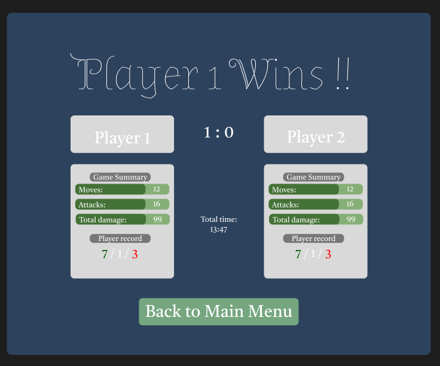

# Game Summary UI Concept

---

## Overview:
The Game Summary Screen is a Pop-up which displays a summary of the game results after each match. It highlights the winner and provides 
relevant gameplay statistics for both players. Additionally, a button is provided to return to the main menu.

---

## Content & Data Requirements

### Game result:
* Displays the result of the Game("Player 1 Wins", "Player 2 Wins", "Draw")

### Game Score:
* Shows the Game Score

### Player Stats:
* Moves: Shows the number of times the player chosed to move instead of attack 
* Attacks: Shows the number of times the player chosed to attack instead of move
* Total damage: The total damage dealt by the player.

### Player Record:
* Shows the general record of the player ("Win / Draw / Loose")

### Game Time:
* Displays duration of the Game

### Return to Main Menu Button:
* Allows the player to return to the main menu

---

## Figma:

