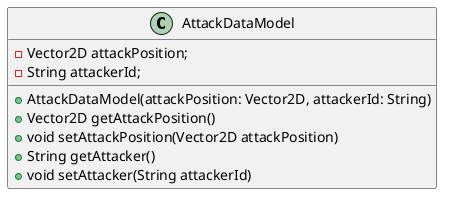

# Attack Data Model
`Author: Jacinto Schwarzwälder`

Attack Data Models represent attacks and store the intended position of an attack,
as well as the ID of the attacking [CharacterEntity](CharacterEntity.md).
As its attributes suggest, such an attack can be applied to [CharacterEntities](CharacterEntity.md)
to carry out an attack.
The following Class Diagram shows how it is structured.

> We are only referencing the ID of the [CharacterEntity](CharacterEntity.md) as a
> String representation instead of more detailed information to save overhead.

