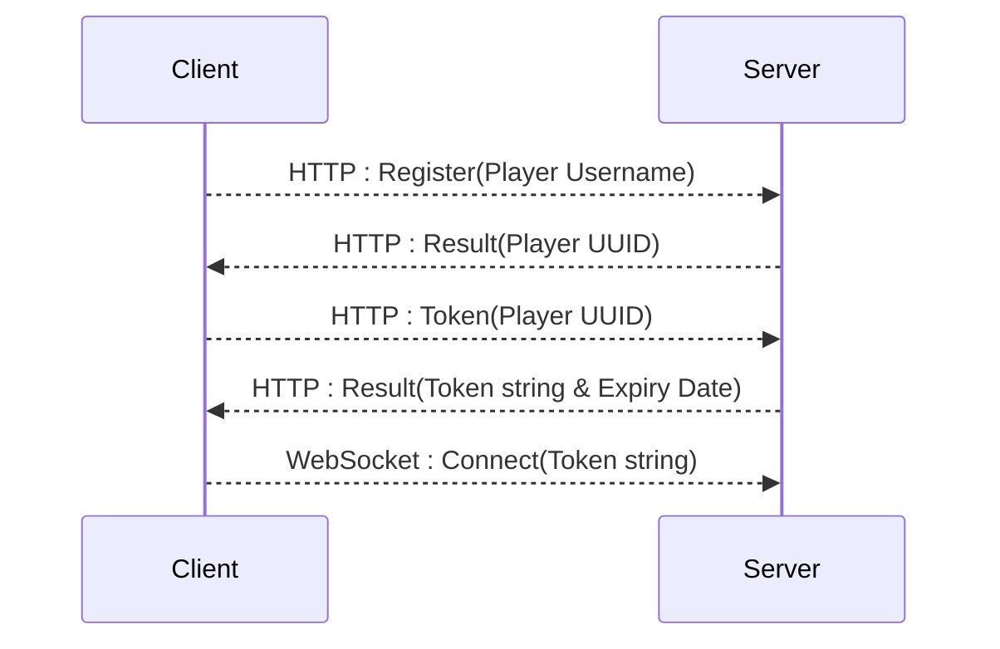

# Authentication

> Within the scope of the MVP, Player's identities are not yet properly secured. They are authenticated once registered
> but the current implementation does not do authentication when requesting a token. This NEEDS to be addressed for proper
> production deployment.
{style="warning"}

As a roadblock, WebSockets do not allow for modification of its headers, in order to still be able to authenticate
users, a token system is implemented. Before a client connects, it first needs to know who he is himself, by retrieving
his own userId and then request a one-time [token](#token). This token is transmitted in the URL Query string. This
ensures the token is only accessible for the duration of the connection attempt.

## Auth Flow

Shown is a Sequence diagram of the authentication flow for the server.

Once the client has sent the token back, it is to be invalidated immediately, otherwise bad actors might be able to
reuse the token and authenticate themselves. It is also crucial that this exchange happens over `HTTPS`, it is otherwise
susceptible to man-in-the-middle attacks.

> This flow is currently provided by the [`Auth Controller`](Controller.md#authentication) click 
> [here](Controller.md#authentication) to read more

## Token

The token consists of a 14 character [Base64URL](https://base64.guru/standards/base64url) string with a CRC8 checksum
attached to form a 16 character token. 

- 14 character [Base64URL](https://base64.guru/standards/base64url) string
- CRC8 Checksum
- V3D5qNVl8IpP2y_qEgQ
- 24
  
{columns="2"}

> The exact way a token is generated can be found [here](Services.md#token-generation).