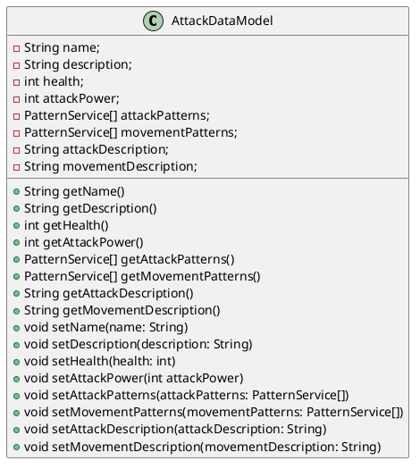

# Character Data Model

`Author: Jacinto Schwarzwälder`

A CharacterDataModel defines all static properties of a character. They represent a model used by the [CharacterEntities](CharacterEntity.md).
See the following class diagram for more information:

As shown, a character has a name and description, as well as a fixed amount of health, attackPower (damage from attacks)
and lists of  for the attack and movement patterns. Additionally, there are descriptions for attacks
and movements.

