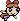
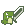

# Characters

Characters are the core entities in *Fantasy-Chess*, representing the playable u
nits on the battlefield. 
Each character has unique attributes, movement patterns, and attack abilities that define their role in the game.

Characters belong to either of the following categories: *Tank, Ranger, Assassin, Warrior, AoE/Mage/Bomber* and *Suicide Bomber*

Their actions, such as moving, attacking, or defending, influence the outcome of the match.
The game logic ensures that each character follows predefined rules based on their stats, position, and available commands.

<!-- This documentation provides an overview of:
- **Character attributes** (health, attack power, movement range, etc.).
- **Character behavior and interactions** within the game.
- **How characters are created, managed, and displayed** in the game world.
- **Character-related UI elements**, such as stats tables and selection indicators.--> 

## Blossom <3

*Description*: attacks a lot damages little
*Category*: Tank
*Hitpoints*: 40
*Damage*: 6
*Attack patterns*: long distance attacks from current position
P(+)
*Subpattern*: -
*Movement Pattern*: -

## Stablin

*Description*: Likes to stab others in their back
*Category*: Assassin
*Hitpoints*: 21
*Damage*: 25
*Attack patterns*:
*Subpattern*:
*Movement Pattern*:

## Flash

*Description*: Can hit you from everywhere
*Category*: Warrior
*Hitpoints*: 17
*Damage*: 6
*Attack patterns*:
*Subpattern*:
*Movement Pattern*:

## Bombo

*Description*: Likes to experiment with explosives
*Category*: AoE/Mage/Bomber
*Hitpoints*: 28
*Damage*: 8
*Attack patterns*:
*Subpattern*:
*Movement Pattern*:

## Fitzooth

*Description*: Robin Hood Fitzhooth simbolizes precision and agility
*Category*: Ranger
*Hitpoints*: 20
*Damage*: 17
*Attack patterns*: -
*Subpatterns*: -
*Movement pattern*: -

## Prometheus

*Description*: He risked divine wrath to gift humanity fire.
*Category*: Suicide Bomber
*Hitpoints*: 10
*Damage*: 20
*Attack patterns*: -
*Sub pattern*: -
*Movement pattern*: -

