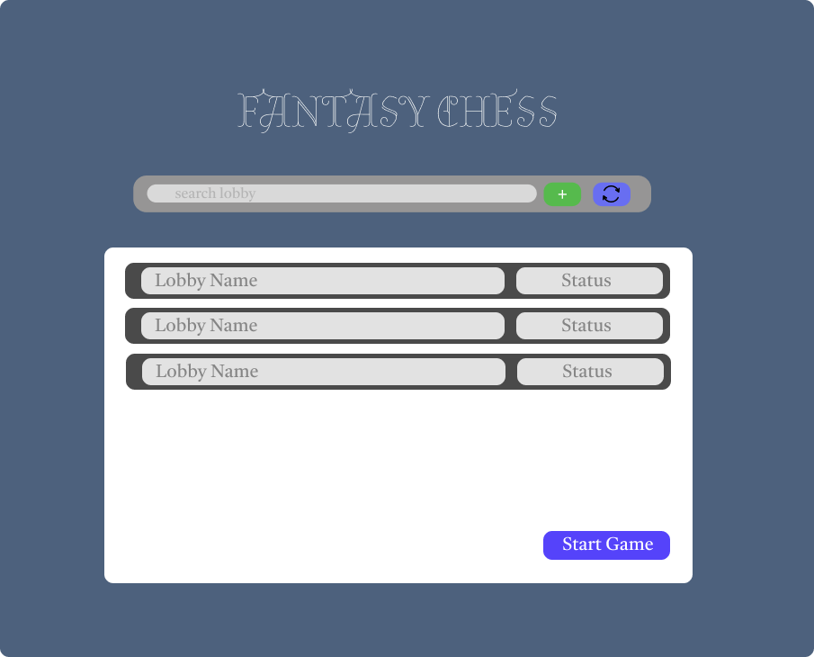
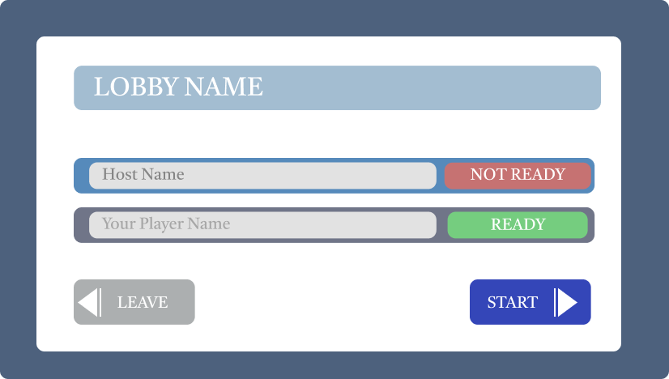
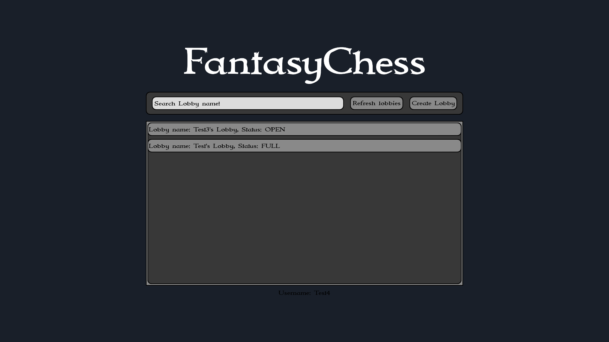

# Design
### Concept
Before developing the digital version of our game, we created a physical prototype using paper. 
This allowed us to test the game mechanics, evaluate whether the game was enjoyable, and establish an initial visual concept.

The next step in the game development process was to translate this prototype into a digital design. 
This phase was crucial not only for creating a fluid and intuitive user experience but also for defining the requirements and expectations for the game. 
To accomplish this, we used the web application *Figma*, a tool specifically designed for UI/UX design. 
By sharing a collaborative link, the entire team could contribute their ideas and work together on refining the game’s visual structure.

A clear digital sketch serves as a guideline for all team members, ensuring that everyone has a precise understanding of what needs to be implemented. 
Based on this visual representation, we were able to define *story points* and *issues* for development. This design approach remained agile throughout the process, allowing us to adapt to changing requirements. For example, we integrated the lobby dialog directly into the main menu to improve navigation and streamline the user experience. Such integrations follow fundamental design principles to enhance usability and consistency.

### Tiled

We used Tiled to create the game’s map. 
This tool allows for the creation of top-down or isometric worlds. 
Our game features an isometric map designed in a chessboard-like pattern. 
Unlike a pre-rendered static background, our map consists of tiles arranged as objects in different layers. 
During gameplay, the system dynamically generates new layers to convey information. 

### Piskel
To design the game’s [characters](Characters.md), we used Piskel, a web-based tool for creating pixel art. 
One of the main challenges was to develop unique and effective designs within a very small resolution. 
A key approach was to avoid using black outlines, instead relying on alternating colors and shapes to define character features. 

### Final Screens & Design Decisions
The final screen layouts ensure that players are guided smoothly toward the essential actions—entering a username and pressing *Play*. 
By minimizing distractions, we eliminate potential misunderstandings and enhance intuitive usability.

#### UI/UX Design Principles Applied:
- **Visual Hierarchy & Clarity:** The interface directs the player's attention to critical elements through structured layout and contrast.
- **Readability & Typography:** The unified font `ìmmortal` complements the fantasy theme while remaining easily readable. High-contrast text, either white or dark gray, ensures accessibility and usability.
- **Consistent Color Scheme:** A deep blue background #191f29 reinforces the mystical theme while keeping the focus on essential game elements.
- **Minimalist & Modern Approach:** The interface follows a clean, simple design, prioritizing ease of use. Colors were harmonized carefully—black was often replaced with dark gray for a softer visual impact.
- **Rounded UI Elements:** All button corners were rounded to *10 degrees* to maintain a modern, minimalistic aesthetic. This subtle refinement contributes to a more visually appealing and user-friendly interface.

By adhering to these fundamental UI/UX principles, we aimed to create an accessible, engaging, and immersive gaming experience for players.

