# Game Instructions

## **Splashscreen: Starting the Game**

- **Description:**
The splash screen displays the title of the game "Fantasy-Chess" prominently.

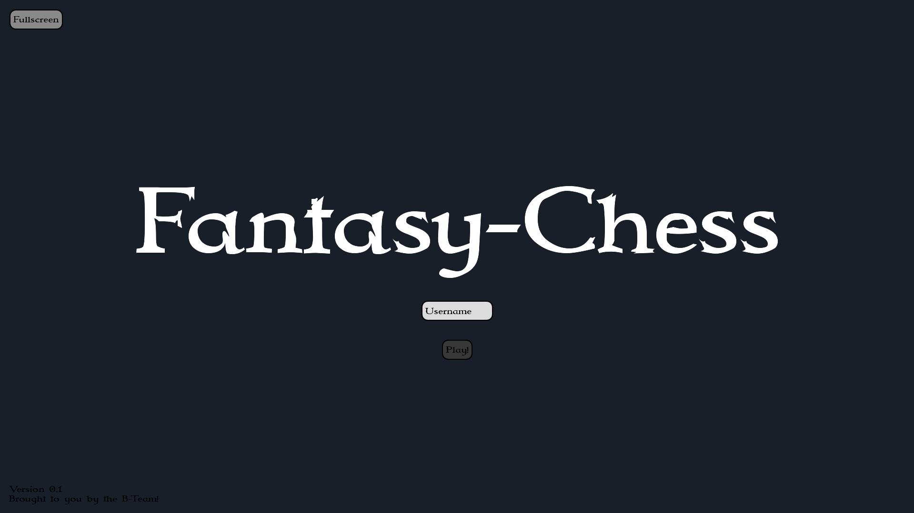
- **Interaction:**
  1. Enter your username in the **"Username"** field.
  2. Click the **"Play!"** button to proceed.
  3. *(Optional)* Click **"Fullscreen"** to switch to fullscreen mode.

## **Lobby Screen: Game Lobby**

### **Searching and Joining a Lobby**
- **Description:** After logging in, the lobby overview appears.

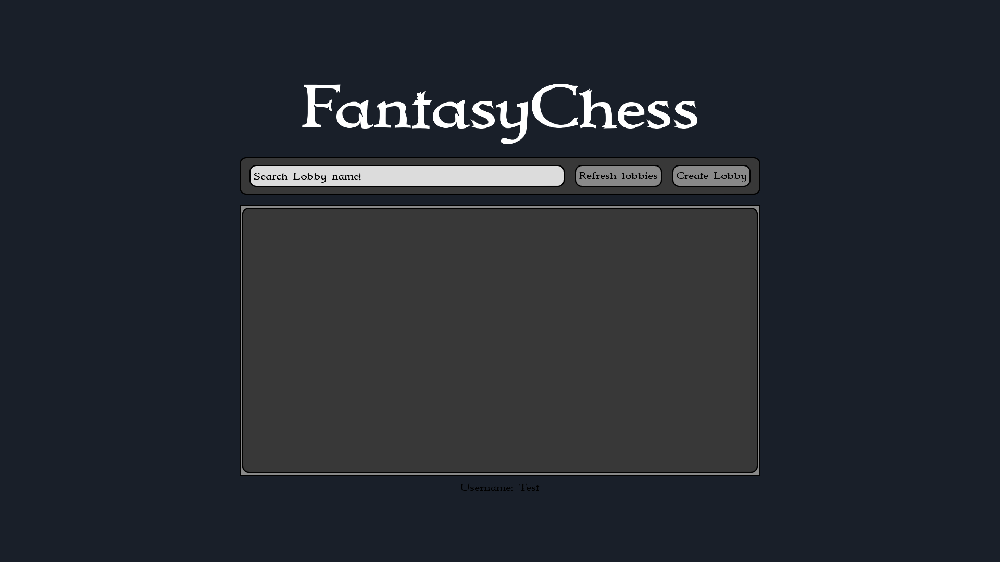
- **Interaction:**
    1. **Search Lobby:** Use the **"Search Lobby name!"** field to find a specific lobby.
    2. **Refresh Lobbies:** Click **"Refresh Lobbies"** to view the current list of available lobbies.
    3. **Join Lobby:** Select a lobby from the list with the status **"OPEN"** to join.

### **Creating Your Own Lobby**
- **Description:** If no suitable lobby is available, you can create your own.

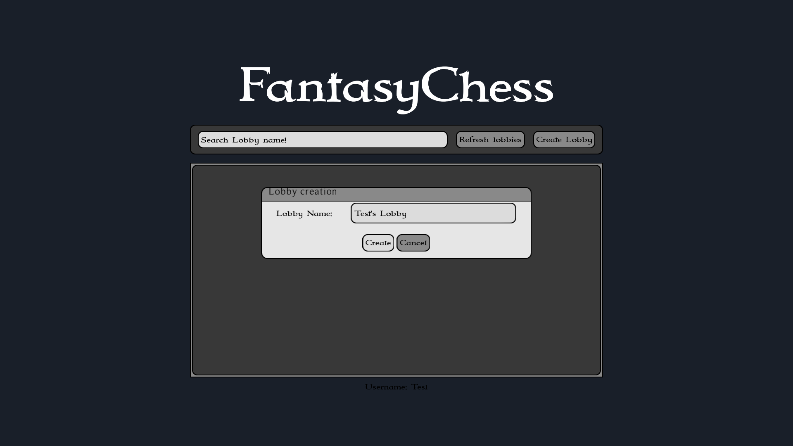
- **Interaction:**
    1. Click the **"Create Lobby"** button.
    2. Enter the name of your lobby in the pop-up window.
    3. Confirm by clicking **"Create"** or cancel by clicking **"Cancel."**
    4. Your created lobby will appear in the list with the status **"OPEN."**

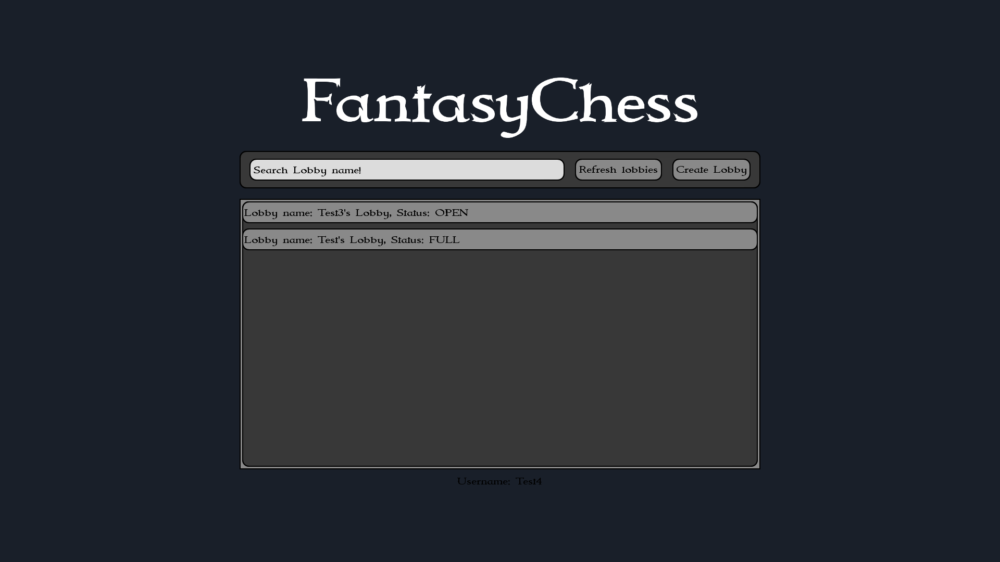

## **Gamescreen: The Match**

### **Waiting for Opponents**
Before the game begins, the empty game board is displayed while waiting for opponent to enter the game.

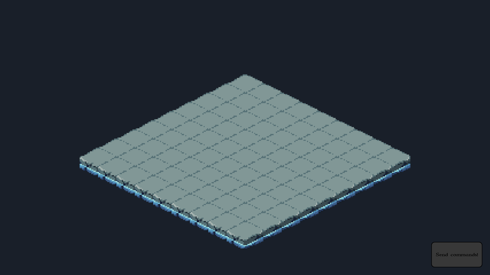

### **Starting the Game**
- **Description:** Once both players have joined, the game board will display green tiles where you can place your characters before the match begins. These tiles indicate the starting positions available for your characters.

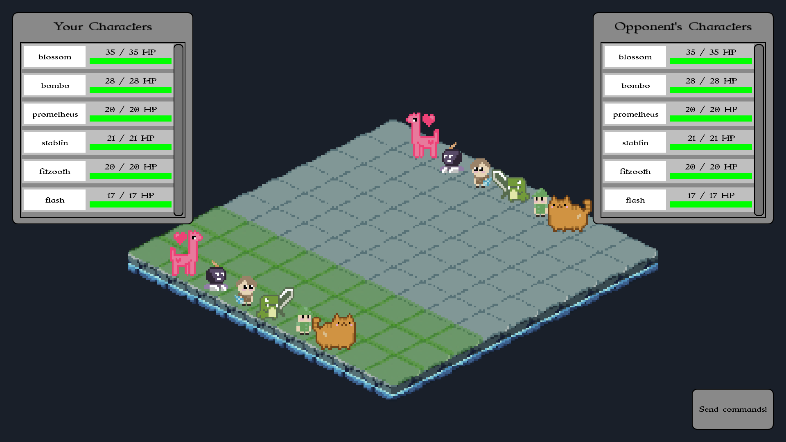
- **Interaction:**
    1. Select one of your characters on the board.
    2. Place your character on one of the highlighted green tiles.
    3. Strategically position your characters to prepare for the battle.
    4. When you’re ready, press the "Send Commands" button.
    5. Once both players have sent their commands, the game will begin.

### **Turn Overview**
- **Description:** On the left side of the screen, you can see the health points (HP) of your characters, while the health points of your opponent’s characters are displayed on the right. This information helps you strategize during each turn.

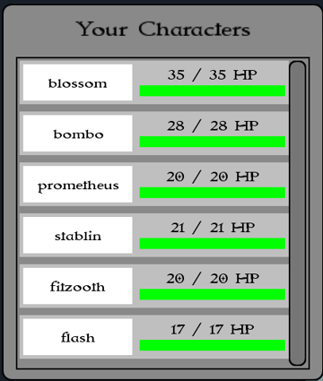
- **Interaction:**
  - Select a character on the board to begin planning your actions.
  - Review the health points and positions of both your and your opponent’s characters to decide your moves.

### **Playing a Turn**
- **Description:** During your turn, you can choose to either move or attack with one of your characters. The interface guides you through the available options step by step.
- **Interaction:**
  1. **Choosing an Action:**
    - After selecting a character, a pop-up menu will appear offering three options: **Attack**, **Move**, or **Cancel**.

  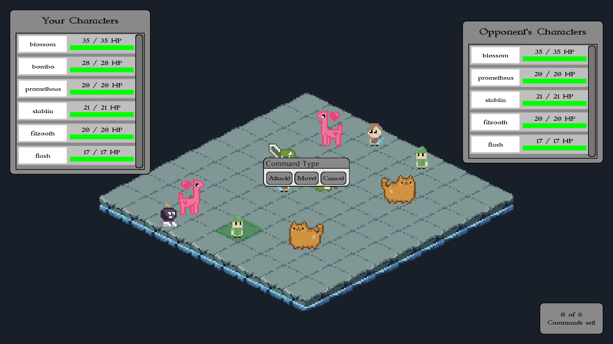

  2. **Attacking:**
  - If you select **Attack**, an attack pattern will appear on the board.
    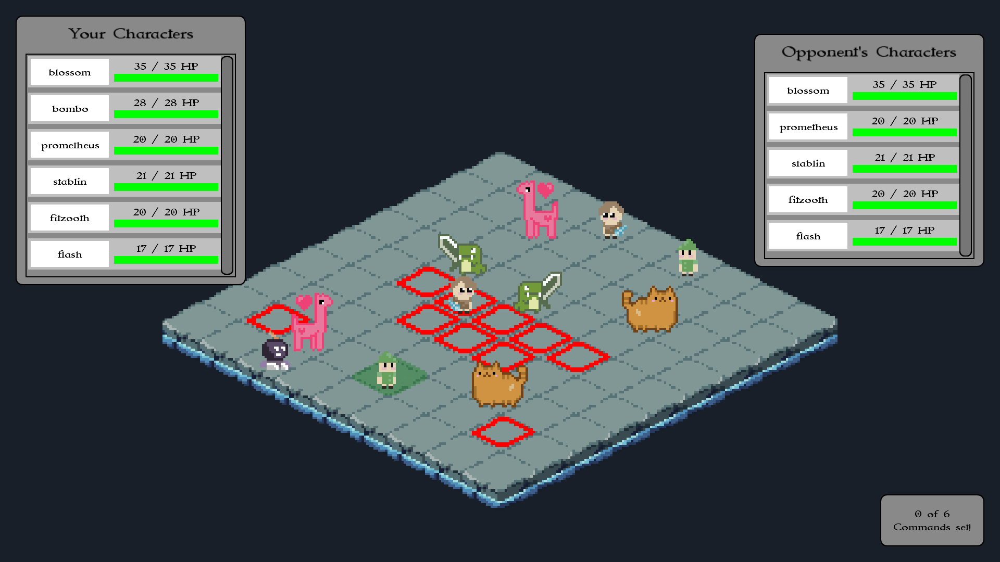
  - Hover over the tiles within the attack pattern to see which tile you want to target. The tile will turn red, and the amount of damage you will deal will be displayed.
    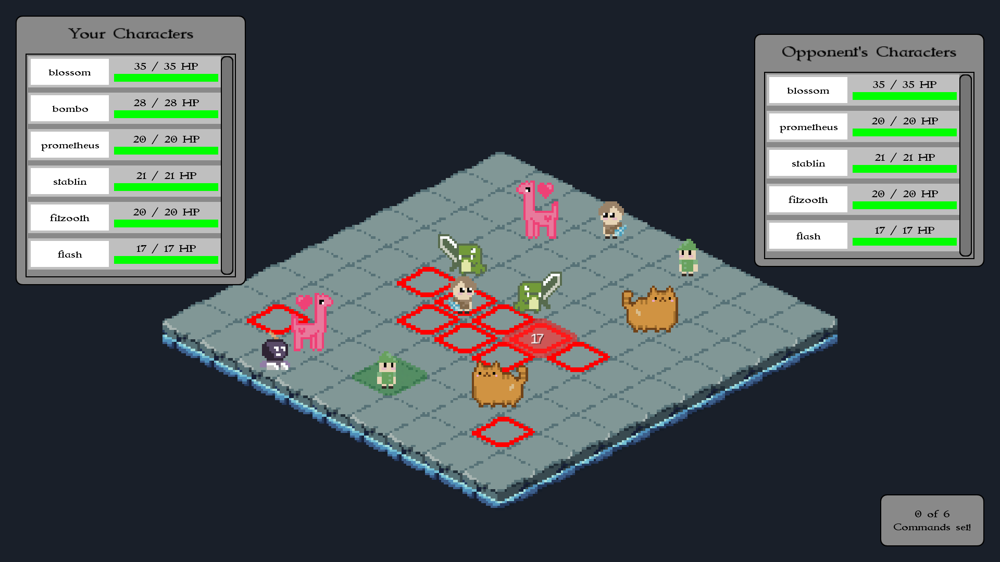
  - Confirm your attack by clicking on the desired red tile.

  3. **Moving:**
  - If you select **Move**, yellow circles will appear on tiles indicating where your character can move.
    
  - Hover over a tile to preview your movement. The circle will fill in yellow to indicate the selected tile.
    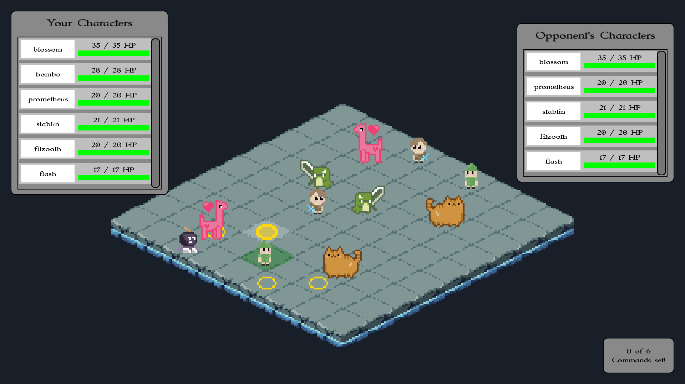
  - Confirm your move by clicking on the desired yellow circle.

  4. **Canceling an Action:**
  - If you wish to cancel your current move or attack, simply click the **Cancel** button to reset the action.

### **Ending the Turn**
- **Description:** Once you are satisfied with your actions, you must send your commands to the server to complete your turn.
- **Interaction:**
  1. Review all the actions you’ve taken.
  2. Press the **"Send commands!"** button located at the bottom right of the screen to submit your actions.
  3. If your opponent has not yet submitted their commands, you will need to wait for them to finish their turn.
  4. When both players have sent their commands, the game will process the results, the turns will be shown on the board and the next round will begin.

### **Game Progression**
- **Description:** The game continues in this turn-based fashion, with each player taking turns to move or attack, until one player has no remaining characters.
- **Outcome:** The player who eliminates all of their opponent's characters is declared the winner.

## **Game Summary: Match Summary**
- **Description:** After the game ends, the winners username is displayed. 
- **Interaction:** Return to the lobby screen to start a new match.
