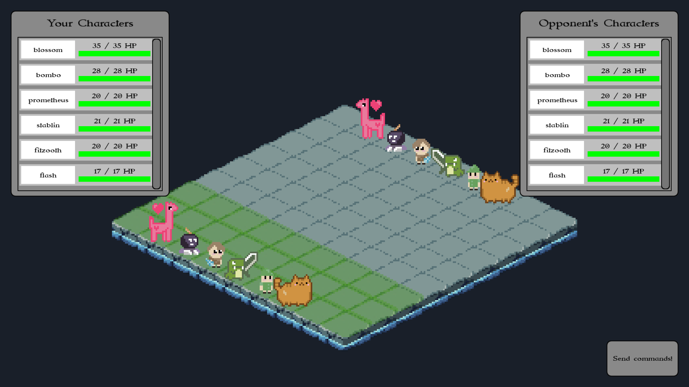
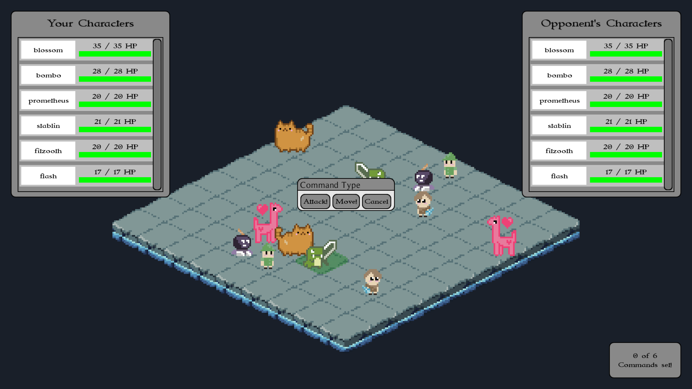
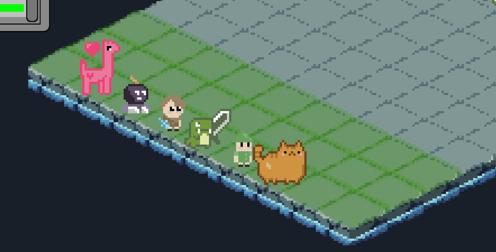
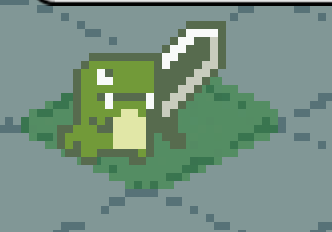
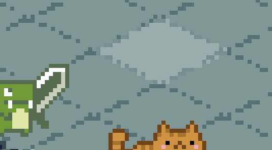
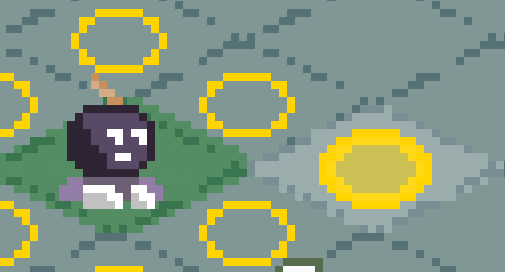
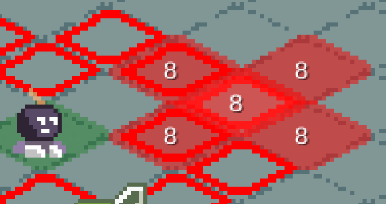

# Game Screen


The Game Screen is the main screen of the game. All gameplay happens here.

See [](Screens.md) for general screen implementation methods and details.

## Creation

The following things happen when the game screen gets created (combination of constructor and show methods):

- Creation of cameras and viewports for rendering
- Creating of font for displaying damage numbers
- Creation of important ui elements like the [readyButton](GameScreen.md#ready-button)
- Creation of the `atlas` for texture retrieval and `batch` for sprite rendering.
- Import of the tiled tmx map used for rendering the map + creation of its renderer
- Creation of the `TiledMathService` for all calculations. See [](Tilemap.md)
- Creation of custom map layers. See [](GameScreen.md#other-layers)
- Registration of input processors. See [](GameScreen.md#map-input-adapter)
- Registration of event and packet handlers used for game state networking. See [](Networking.md#websocket-service)

The two stat panels are created later on in the [](GameScreen.md#game-initialisation). See [](GameScreen.md#stat-panels)
for information about them.

## Game Phases

The entire time a players game shows the Game Screen, it is in some kind of phase.
These phases represent the current context of the game screen and are use to regulate the flow of the game and
contextualize inputs.

The states are saved in the `MapInputAdapter` which is where most calls referencing this state are happening.

When creating a lobby in the [](MainMenu.md), the game [navigates](Screens.md#screen-manager) to the Game Screen.
This puts the Game Screen in the [Lobby Phase](GameScreen.md#lobby-phase) by default.

### Lobby Phase

The lobby phase stats when the screen is created and ends when the game starts.
Both players have to be ready at this point.
Leaving the lobby phase puts the screen into the [Game Initialisation Phase](GameScreen.md#game-initialisation).

### Game Initialisation




Entering the Game Initialisation Phase brings the game to life.
This process gets initiated by receiving the `GAME_INIT` packet, which calls the `initializeGame` method.

````Java
getWebSocketService().addPacketHandler("GAME_INIT",
    str -> Gdx.app.postRunnable(() -> {
        getGameStateService().registerNewGame(9, 9);
        var characters = CharacterEntityMapper.fromListDTO(str);
        String gameId = new JsonReader().parse(str)
            .get("data").getString("gameId");
        getGameStateService().setGameId(gameId);
        getGameStateService().setCharacters(characters);
        initializeGame();
}));
````

This method updates the current phase in the [](GameScreen.md#map-input-adapter), 
handels the configuration and presentation of the start tiles (See green area on the image) of the [](GridModel.md) and
creates the [Character Sprites](CharacterSprite.md) for all [](CharacterEntity.md).
This is also when the [](GameScreen.md#stat-panels) are created.

In this phase, the players are able to position their characters however they want. Their final placement is shown
to the other player only after both players logged in their positions. 

The placement logic behind this is explained [here](GameScreen.md#map-input-adapter).

When the player logs in his choice using the [](GameScreen.md#ready-button), the screen will be put into the `Waiting
for Turn Outcome` Phase.

### Waiting for Turn Outcome

This phase describes the phase between sending the commands and receiving a response from the server.
As soon as the [TurnResult](Turn-Logic.md) arrives, the screen starts the `Turn Outcome Animation`.

### Turn Outcome Animation

This phase is responsible for displaying the turn outcome animation. See [](TurnOutcomeAnimations.md).
As soon as the animation is over, the screen enter the Command Phase.

### Command Phase



This is the phase the player will spend most time in. All command and planed and chosen here.

### Game Summary

This phase is the last phase of the game loop. Its shows both players the winner of the game in a `Dialog`.

## Map Rendering

The map was created using the tool [Tiled](http://www.mapeditor.org/) and exported as a tmx file.
This file can be loaded using the TmxMapLoader to directly manipulate and render it in game.
The map itself is stored in the base layer of this map, every single tile being saved with all nececarry
information for its depiction.

## Other Layers

All information about the status of tiles or the possibility or effect of certain commands is delivered
using visual clues. Most of these are implemented using custom layers in the `TiledMap` using `TiledMapTileLayers`.
By creating these layers, configuring their tiles to display certain textures and adding them to the tiled map object,
they can be rendered to the screen.

The following custom layers are used in the game:

#### Start-Rows Layer



This layers contains the transparent green tiles seen in the [](GameScreen.md#game-initialisation).
It shows the player the area in which the player can move or swap his characters during the phase.

#### Selected-Character Layer



This layers contains a single green tile to show which character is currently selected when giving commands.

#### Highlight Layer



This layer contains the single highlighting the current tile hovered by the player.

#### Command Option/Preview Layer

{width=400}

{width=400}

The command option layer depicts all valid target tiles of an attack/movement command.
In the images, it is responsible for the yellow circles (movement options) and red squares (attack options).

The command preview layer visualizes the result of a command. Its responsible for all filled out tiles in yellow
(movement) and red (attack area).

## Ready Button

The ready button lets the players send their commands. His text gives some hints about the current state of the game,
displaying the amount of commands set in the current round or tells the player to wait for his opponent.
He is updates using his `act(float delta)` method that's called together with `stage.act()` in the rendering method and
in situations where he should not be pressed.

## Stat Panels

The stat panels are the two large panels on the top sides of the screen. They display the current status of
all characters currently alive on the board. The hp bars are colored according to their current hp.
Clicking on a character opens a `Dialog` that displays all information about the character.

## Map Input Adapter