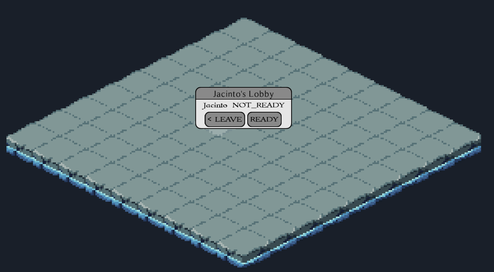
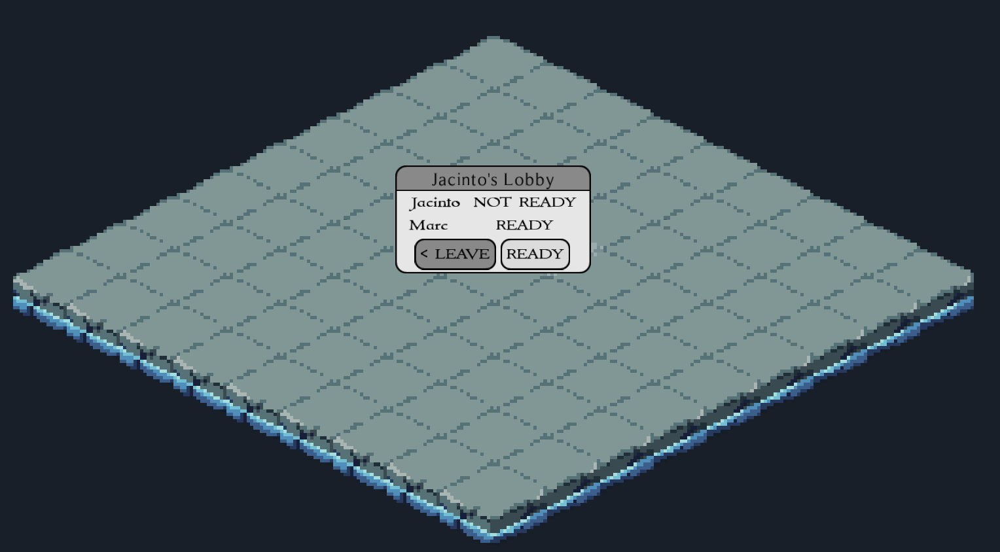

# LobbyScreen
`Author: Jacinto`

The Lobby Screen is a small dialog window to show to waiting players after creating or joining a lobby 
and allows them some additional control about whether to enter the game immediately or not.

When a player creates a lobby, he is automatically transferred to the lobby screen. On top of the screen,
the lobby name is displayed. Below are the names of all players in the lobby and their respective status 
(READY, NOT_READY). Below is a `Leave` button that will take the player back to the Main Menu and close the 
lobby if the host leaves. Next to it is the `Ready` button which will toggle the ready status.

If another player joins, the names are automatically updated and in similar fashion, 
the ready statuses are always kept up-to-date for both players.

