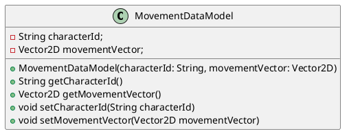

# Movement Data Model
`Author: Jacinto Schwarzwälder`

Analogous to the [AttackDataModel](AttackDataModel.md), Movement Data Models represent movements
and store the direction of a movement, as well as the ID of the moving [CharacterEntity](CharacterEntity.md).
As its attributes suggest, such movements can be applied to a [CharacterEntity](CharacterEntity.md)
to move it.
See the following class diagram for more information.

> We are only referencing the ID of the [CharacterEntity](CharacterEntity.md) as a
> String representation instead of more detailed information to save overhead.

