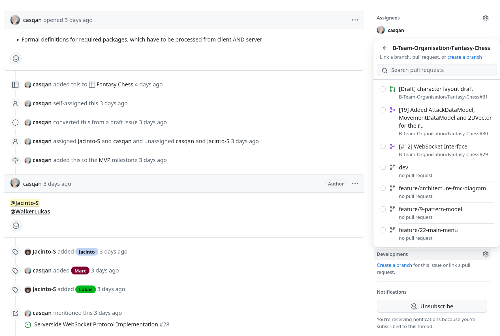
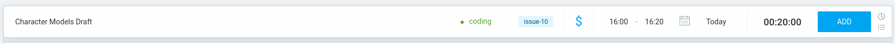
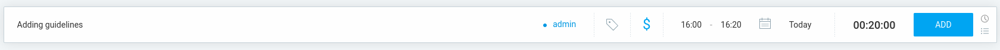

# Organization
`Author: Jacinto Schwarzwälder`

The project was organised using scrum. To manage it, we used various platforms as explained below. 
Some team members also had the additional responsibility to make sure that things went smooth in regard 
to a topic, as listed:

- Marc Matija: Scrum Master & Coordination
- Lukas Walker: Quality
- Adnan Bennis: Documentation
- Dania Anwar: Design Lead
- Jacinto Schwarzwälder: Respository and PM Tools

## Scrum
- A sprint for us was 2 weeks long.
- We met online once a week to consolidate progress and plan the next week.
- We met once a week in person, every tuesday from 08:00 to 14:00 at Hochschule RheinMain unter den Eichen to work on 
the project together.
 
## Platforms

### GitHub
GitHub was used for hosting our [Git repository](https://github.com/B-Team-Organisation/Fantasy-Chess) and for 
task management using a [GitHub project](https://github.com/orgs/B-Team-Organisation/projects/1).
Within said project, we used a Kanban to manage issues. Issues had the following categories:

Backlog
: Planned in the future, but either blocked or not planned in the current sprint.

{type="narrow"}

Ready
: Ready to be worked on, but not started.

{type="narrow"}

In progress
: Issue is actively worked on.

{type="narrow"}

In review
: Has a pull request and is being reviewed.

{type="narrow"}

Done
: This has been completed and merged into the dev branch.

{type="narrow"}

For branching, we used the [dev branch](https://github.com/B-Team-Organisation/Fantasy-Chess/tree/dev) as a protected 
branch for development. From it, we created feature branches of the structure 
`<type>/<issue-number>-<issue-name>`, e.g. `feature/27-turn-logic`. They were merged as a pull request after 
at least one approving review and passing all checks.

We also used [GitHub Discussions](https://github.com/B-Team-Organisation/Fantasy-Chess/discussions) for 
collecting ideas, [meeting notes](https://github.com/B-Team-Organisation/Fantasy-Chess/discussions/6), different polls and any 
placeholder documentation that was needed before starting to document in the main repository.

### Discord
Discord was used for fast communication and online meetings. On our Server (not linked for privacy, new members can contact us to join),
we used different text channels to communicate mostly organizational things. Voice channels served for our weekly meetings.

### Clockify
Clockify was used to track time. It was chosen because it allows very fast and simple time tracking.
We used the project field to mark which project we are working on and the tag field to document issues.
This is further explained in the [guideline section further below](Organization.md#clockify)
For more information on how to use clockify, please refer to the [official documentation](https://clockify.me/help/getting-started/clockify_basics/introduction-to-clockify).

## Rules and Guidelines
To ensure a smooth project experience where all members work by similar standards, we defined a list of rules and 
guidelines. Before we started documenting, they were already hosted as a 
<a href="https://github.com/B-Team-Organisation/Fantasy-Chess/discussions/34" summary="Rules and guidelines, as found under Fantasy-Chess -> Discussions -> Guidelines">
GitHub Discussion</a>.

They defined guidelines for coding, using GitHub and Clockify, writing Documentation and approaches to good teamwork.
Template for a new rule  (copy and paste):

<tabs>
    <tab id="writerside-template" title="Writerside">
        <code-block lang="markdown">
        #### Guideline {collapsible = true}
        Details
        </code-block>
    </tab>
    <tab id="github-template" title="GitHub">
        <code-block lang="markdown">
            <![CDATA[
            <details>
            <summary>Guideline</summary>
            <br/>
            Details
            </details>
            ]]>
        </code-block>
    </tab>
</tabs>

> Guidelines are written as expandable summaries. This is to account for varying experience levels within the team.
> For example, one member might be used to using conventional commit messages and read the summary, whereas another 
> member might not know it. In this case, they can simply expand the summary. This improves speed, since new members 
> can skim the list much easier and expand on anything, that they might not be sure on.

### GitHub / Git

#### Use conventional commit messages. {collapsible = true}
We're using bracketed tag style commit messages like this:

``` md
[type] <description>

<optional body>

<optional footer(s)>
```

Common Types are:
```
- [Feature]: A new feature
- [Fix]: A bug fix
- [Docs]: Documentation only changes
- [Refactor]: A code change that neither fixes a bug nor adds a feature
- [Test]: Adding missing tests or correcting existing tests
- [Style]: Changes that do not affect the meaning of the code (white-space, formatting, missing semi-colons, etc)
- [Perf]: A code change that improves performance
- [Chore]: Changes to the build process or auxiliary tools and libraries such as documentation generation
- [Build]: Changes that affect the build system or external dependencies (e.g. Gradle)
- [CI]: Changes to our CI configuration files and scripts (example scopes: Travis, Circle, BrowserStack, SauceLabs)
```

Example:
```
[Feature] adding attack patterns 
```

For further information, please refer [here](https://www.conventionalcommits.org/en/v1.0.0-beta.2/).


#### Use feature branches, pull requests and squash when merging. {collapsible = true}
Don't make changes or push to main (or dev without an approved pull request). Punishment is bringing cake for the team on the next meeting or cookies if pushed to dev. <br /><br />

For changes, create a new feature branch, based from dev. If you're working on an issue, you can create it directly from there:
 {width="705"}


Before restarting work on your branch and especially before creating a pull request, run `git fetch origin` so there are no merge conflicts from changes to the dev branch in the meantime of you working.


When you're done with your feature, create a pull request of the structure:

`[#issue-number] Pull request description (#Pull request number)` 

The Pull Request number should be added by GitHub automatically.


Someone else from the team has to review and accept it. Both are responsible for the code. Communicate in the comments if the feature isn't ready to be merged to dev yet. After acceptance, select `Squash and merge` to create a single commit for the pull request.


#### Use the Kanban board to show what you're working on. Don't work on more than one thing at a time. {collapsible="true"}

Find the Kanban board under B-Team-Organization -> Projects -> Fantasy Chess -> Current Sprint.<br /><br />

`Backlog` items are possible issues for the sprint. When it makes sense to work on them, they go to `Ready`. When you start working on something, pull it to `In progress`. You should never be working on more than one issue at a time.<br />After creating a pull request, put it into `In review`. After merging / completion, put it into `Done`.


#### Use Labels to add multiple assignees to an issue. Filter by labels to find your issues. {collapsible = true}
Unfortunately, GitHub allows multiple assignees for paying organizations. Since we are broke students, we are using labels to mark the assignees. To find your issues, you can filter them by label (search for your name). To make this work, every assignee needs to be labeled, even those that have been formally assigned.<br /><br />

There is an individual view for each member in the board, because filters are set organization-wide. Also, you need to add labels to the view to be able to filter for them.

#### If something with GitHub Markdown doesn't work, try using more line breaks. {collapsible = true}
GitHub Markdown is a bit buggy. A common problem is that HTML tags that are too close to other markdown elements (links, code blocks, closing detail blocks...) can break them. Example: <br /><br />

```md
<br/>
[link wouldn't work](www.google.com)

<br/>

[link would work now, because of the line break after the br tag](www.google.com)
```
 
#### Write meaningful issue descriptions {collapsible = true}

Each issue needs the following:
* Description: A description of the issue at hand describing what the issues tries to achive.
* Requirements: A list of all the features that have to be implemented for the minimum requirements to be met.
* Optional: Way of testing. How to test the functionality of the implementation.


Format:

```md
**Description:** 
* ...

**Acceptance Criteria:**
* ...

**Testing:**
* ... 
```

### Coding


#### Use test-driven development. {collapsible = true}
Write your test before the code implementation. A good workflow would be to create your classes, write out all docstrings and method heads. Then write the tests and only then write the actual method implementation. This way, you can plan the architecture and use it for the tests but are less likely to write tests to be easier on your implementation.<br/><br/>
Tests are mainly written in [Junit5](https://junit.org/junit5/docs/current/user-guide/).<br/><br/>
Tests should be economical, i.e. make sure that everything works in all feasible scenarios but don't waste time with tests that will absolutely not be needed. As a rule of thumb, logic should be testet but things like a standard constructor doesn't have to.<br/><br/>
Write unit tests for basic checks and integration tests if things are interacting. System tests will most likely be done when everything is complete, use your own judgement / discuss with team.


#### Comment your code {collapsible = true}
Write Docstrings for your classes and for any methods that aren't self-explanatory by name.<br/><br/>

Refer to the [JavaDoc Reference](https://www.oracle.com/technical-resources/articles/java/javadoc-tool.html) if needed. Here are examples for good class and method docstrings:
```java
/**
 * Data model for the map grid
 * <p>
 * This class represents a grid of tiles. Its dimensions are defined by the amount
 * of {@link GridModel#rows} and {@link GridModel#cols}.
 * Each tile is represented by an instance of the {@link TileModel} class.
 * The grid is initialized with empty tiles.
 * <p>
 * The coordinate origin of the grid ("tileGrid[0][0]") lies in the top corner of the map.
 * The rows correspond to y-coordinated, the columns represent the x-coordinates.
 * By this definition, a tile is addressed by tileGrid[row][column].
 *
 * @author Lukas, Albano
 * @version 1.0
 */
```

```java
 /**
 * Tries to swap the two characters from tiles {@code one} and {@code two}.
 *
 * @param one {@link Vector2D}-position of the first character
 * @param two {@link Vector2D}-position of the second character
 * @throws DestinationInvalidException if one of the positions is out of bounds
 * @throws NoCharacterFoundException if one of the {@link TileModel} doesn't contain a {@link CharacterEntity}
 */
```


#### Follow clean code principles {collapsible = true}

- Boy Scout Rule: Always leave the campground cleaner than you found it (in our case, correct typos and so on and if you find problems with the implementation, contact the one who wrote it)
- Intention-revealing names: Names should reveal the functionality of methods and classes
- YAGNI: You ain't gonna need it (so don't add it if it isn't a requirement)
- DRY: Don't repeat yourself
- KISS: Keep it simple, stupid
- Law of Demeter: An object should only communicate with closely related objects, avoiding chained calls
- SOLID:
    - Single Responsibility (Each software module has one, and only one, reason to change)
    - Open Closed Principle (Open to changes, closed for modification)
    - Liskov Substitution Principle (Parts must adhere to a contract that allows those parts to be substituted one for another)
    - Interface Segregation Principle (Avoid depending on things that you don’t use)
    - Dependency Inversion Principle (High level should not depend on low level, using abstractions instead)
- [Design Patterns](https://refactoring.guru/design-patterns) (not as important as the rest)


#### Use the correct Java Version {collapsible = true}
Frontend: Java 11
Commons: java 11
Backend: Java 21

### Using Clockify

#### Log coding with your issue as a tag and coding as the project. {collapsible = true}

Open [clockify](https://app.clockify.me/tracker) and log as in the example.<br/>
 {width="705"}


#### Log administrative things as admin or add a new project if doing something else {collapsible = true}

Open [clockify](https://app.clockify.me/tracker) and log as in the example.<br/>
 {width="705"}

### Documentation


#### Document your code well, as shown in the coding section {collapsible = true}

Refer to the [coding section](Organization.md#coding).


#### Use discussions to log best practices, guidelines, meeting notes, tools and ideas {collapsible = true}
<br/>

Use the appropriate [Discussion](https://github.com/B-Team-Organisation/Fantasy-Chess/discussions).


#### Use Writerside for general documentation {collapsible = true}
Use Writerside to write documentation in the documentation folder of the [Fantasy-Chess Repository](https://github.com/B-Team-Organisation/Fantasy-Chess). Of course, pull requests are still required.

[Writerside Documentation](https://www.jetbrains.com/help/writerside/discover-writerside.html)
[Our Writerside Documenation](https://b-team-organisation.github.io/Fantasy-Chess/organization.html)

### Teamwork

#### Show up on time! {collapsible="true"}
Don't let your teammates wait for you. Those who are late without notice have to bring cookies to the next meeting.

#### Share or implement your ideas. {collapsible = true}
Everybody is doing things to their best knowledge. If you have better ideas, or you want anything to be done different, discuss it with the team and/or implement it (discuss important things first).


