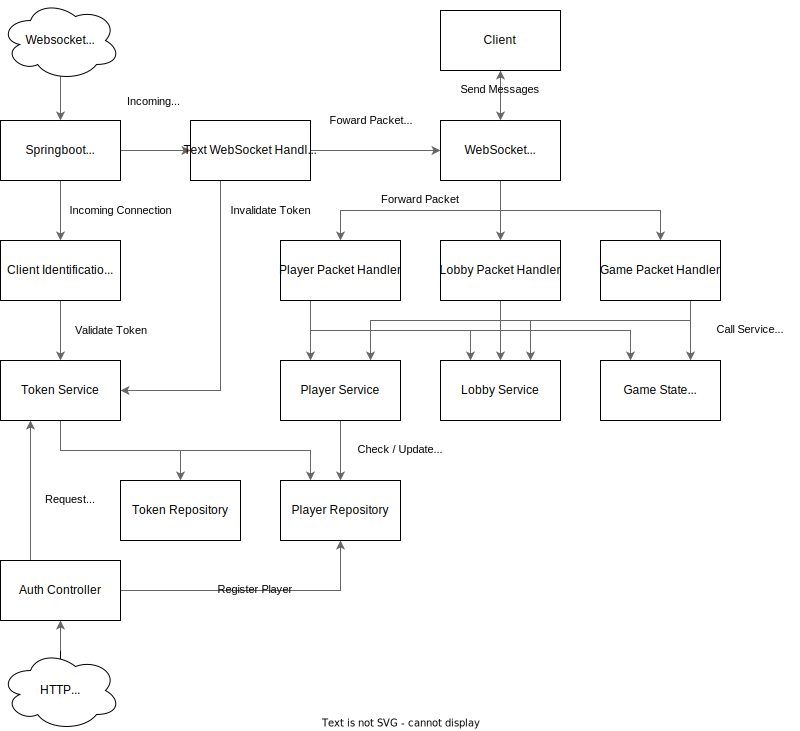

# Server

`Author: Marc Matija`

The Server consists of a Spring Boot project which acts as a websocket server using Spring Messaging. However, instead
of using the STOMP framework which comes with Spring Boot by default a proprietary system is used due to the 
restrictions of the [client websocket implementation](Networking.md#gdx-websockets). The server also makes use of
Hibernate to store Player's usernames and link them to UUIDs. 

## Data Flow
The server handles incoming [Packets](Packet.md) using PacketHandlers, which get registered with the WebSocketService,
upon creation. When the Server receives a Packet, it hands the client it got the current packet from and the packet as a
string to the WebSocketService, which delegates the packet given the id to the responsible 
[Packet Handler](Packet-Handler.md).