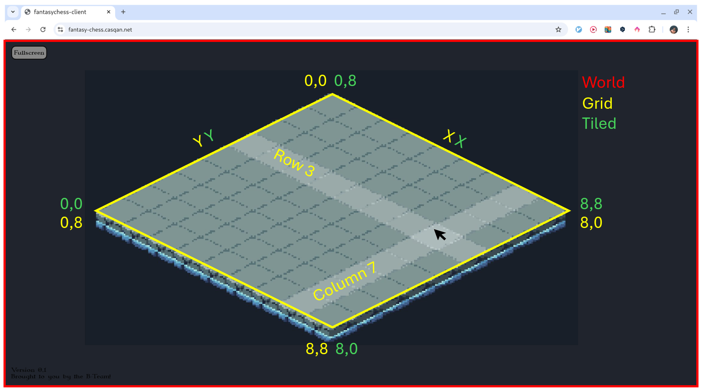
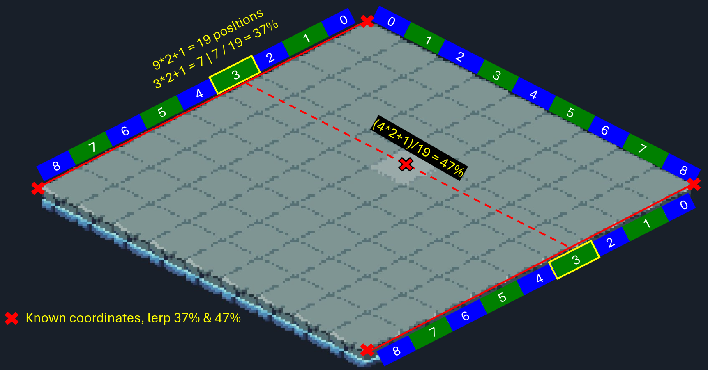
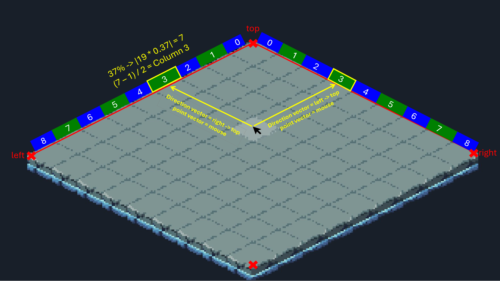

# Tilemap

### Coordinate System Conversions

##### There are three coordinate systems:

<deflist type="medium">
    <def title="World Coordinates">
        The x and y coordinates on the client's screen.
    </def>
    <def title="Grid Coordinates">
        Coordinates on the tile map, represented by rows and columns.
    </def>
    <def title="Tile Coordinates">
        The internal coordinates used by `gdx.maps.tiled`, 
        which are the same as grid but with y inverted.
    </def>
</deflist>

> Tile coordinates differ from the grid coordinates we use, because of technical debt. They could
> be merged, but we found it more intuitive to have (0, 0) at the top, rather than on the left.
 

{width="705"}

Because we are using isometric tile maps, which are rotated along the z axis to create the illusion of 3D, the position of the mouse (world coordinates) can not be easily converted 
to a specific tile on the grid (grid coordinates). The `TileMathService` provides a way to calculate this, independent
of any screen sizes and mostly of the map format. It provides methods to go from screen to grid and the other way around.

To create a `TileMathService` instance, you need the `TiledMap` and the width and height of both the map and an 
individual tile.  

You can use the `gridToWorld` method to convert row and column numbers to x and y world coordinates
of the middle of a tile. This is particularly useful for placing characters.  
The `worldToGrid` method is primarily used 
to convert the user input to a position on the map by taking in said x and y coordinates to convert to grid column 
and row positions.   
Lastly, there's a `gridToTiled` method which will convert grid coordinates to tiled map 
coordinates and is used before interactions with `gdx.maps.tiled`.

> In the following, we will be using linear algebra.  
> We are defining a line in parametric form as:
> <math> \mathbf{r}(t) = \mathbf{r_0} + t \mathbf{d} </math>  
> Where <math>r(t)</math> is any point on the line, 
> <math>\mathbf{r_0}</math> is the point vector (a given point on the line),
> <math>\mathbf{d}</math> the directional vector (the direction of the line, which can be calculated by subtracting any point on the line)
> and <math>t</math> the scaling parameter (multiply <math>\mathbf{d}</math> to move from the point vector to any point on the line, using the direction of <math>\mathbf{d}</math>.
> Calculating <math>r(t)</math> can also be called linear interpolation.
> 
> We are also refering to the edges as top, bottom, left and bottom as given by their position on the grid.

<procedure title="Grid to World Algorithm" id="gridToWorld">
    
Given: The edges of the grid as points in world coordinates (x, y), marked with red "x"'s in the figure below and
    the point that we're searching for, marked with the red "x" in the middle (also in world coordinates).
    

    <step>
    Use the edge points to form a line on the column edges, one from left to top and one from bottom to right.
    </step>
    <step>
    Using percentages of the tile to width ratio, project the point onto the column lines (factor <math>t</math> for <math>\mathbf{r}(t)</math>).
    The tile to width ratio is calculated by converting each column into tile halves (tile count * 2 + 1, where + 1 because we want the middle of the tile and count * 2 gives the start of the tile) and then
    dividing the (converted) desired column number by the amount of tiles on a column (see example in image below for column=3).
    </step>
    <step>Using the percentage, we can use linear interpolation to go to the middle of the tile representing the column number, for both lines.</step>
    <step>We can use both points and repeat the same process but for rows to get to our final target point.</step>
    <step>Because we have been using world coordinates for all the edge points, our final result is also in world coordinates.</step>
    
(As shown in the example figure below)

</procedure>

{width="705"}

> Because this is dynamically calculated using the map size, it works completely independent of 
> the maps' size and shape, as long as it is rectangular.
{style="note"}
 
<procedure title="World to Grid Algorithm" id="worldToGrid">
    <step>Take two lines from left to top and right to top edges.</step>
    <step>
    We can create two new lines using the point we are calculating as point vector and the directional vector of each line, respectively.
    This is useful, because we can now calculate where those lines are crossing with the lines from the edges, thus projecting the point 
    that we're looking for onto the column and row lines.
    </step>
    <step>Use both projected points on the lines to calculate the percentages, just as in the grid to world algorithm.</step>
    <step>Round the percentages to the respective column/row number.</step>
    
(As shown in the example figure below)

</procedure>

{width="705"}

> Note, again, that this works independently of the maps shape and size.
{style="note"}
 
<procedure title="Grid to Tiled Algorithm" id="gridToTiled">
    
Inverts the y coordinate.

</procedure>

