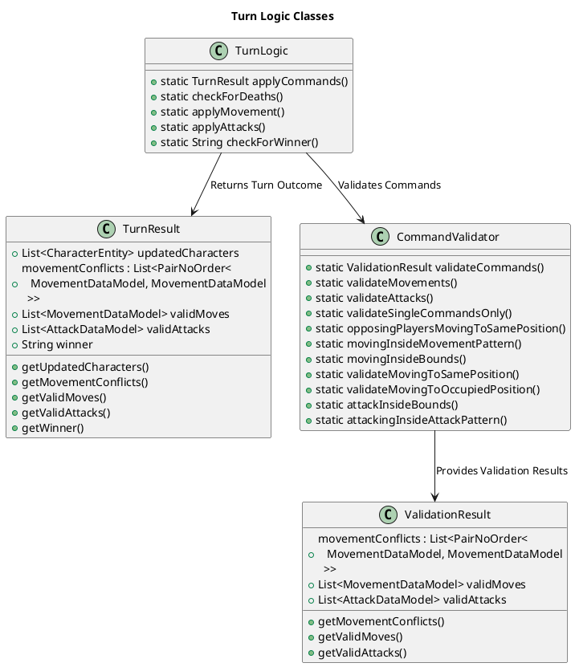
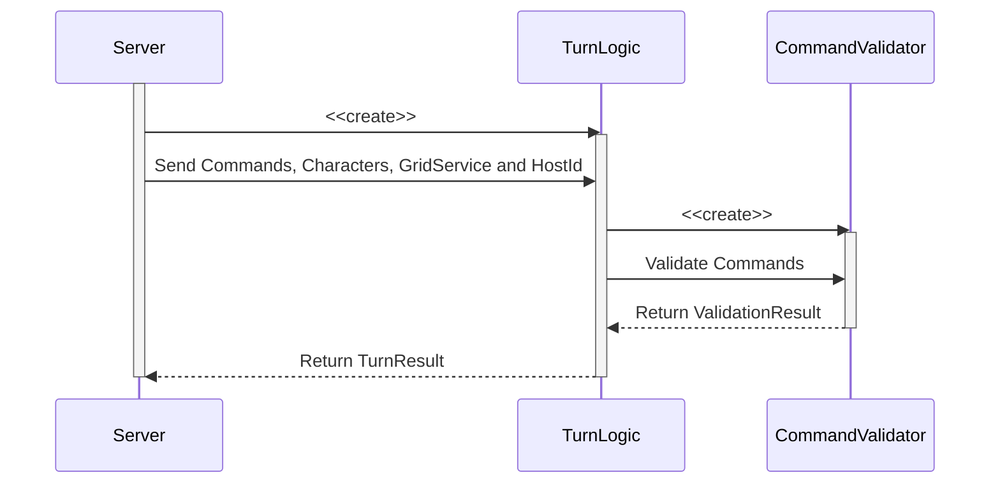
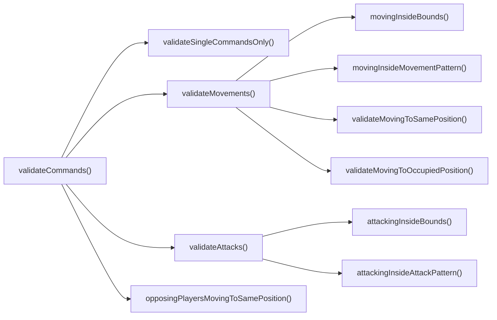

# Turn Logic
`Author: Jacinto Schwarzwälder`

The Turn Logic handles the application of all turn-related rules *after the commands have been sent by the players*.
Thus, its scope is all movement and attack commands as well as the potential result of the game.

For the application of a turn, the TurnLogic component is structured into two steps:
1. Check if commands follow all rules
2. Apply the commands that are valid

Both these requirements are met with utility classes exposing not only a general method to do these steps, 
but all important helper methods that the methods are broken down into.
This way, the server can perform all checks at once, whilst additional features can use individual rules and procedures.



The general procedure is as follows: <br/>
The client sends all commands to the server. The server takes those commands and adds its own version of the 
<a href="CharacterEntity.md">CharacterEntities</a>. These will be given to the `TurnLogic`, which will firstly validate them using the `CommandValidator`,
and then apply all valid commands and return the modified characters and other processing information described below back to the server.

This method of the `TurnLogic` will do all the aforementioned:
```java
    public static TurnResult applyCommands(
            List<MovementDataModel> moves,
            List<CharacterEntity> characters,
            List<AttackDataModel> attacks,
            GridService gridService,
            String hostID) {
            ...
    }
```

> Commands are validated with characters stored in the server to filter any client mistakes and to avert any cheating.



#### 1. Command Validation
The `CommandValidator` class validates that attack and movement commands follow all game rules.
<procedure title="Turn-Related Game Rules:">
<anchor id="rule1" name="rule1"></anchor>
<step>Each Character can only have one command.</step>
<anchor id="rule2" name="rule2"></anchor>
<step>Characters may not attack or move out of bounds regarding the grid map.</step>
<anchor id="rule3" name="rule3"></anchor>
<step>Characters may not move or attack different to the movement/attack pattern as defined by their <a href="CharacterDataModel.md">CharacterDataModel</a></step>
<step>A character may not move to where another character already is (even if they are set to move away during that turn).</step>
<step>Multiple characters of the same player may not move to the same position.</step>
<anchor id="rule6" name="rule6"></anchor>
<step>Characters of opposing players may not move to the same position.</step>
</procedure>

> Movement to the same position is separately checked for opposing players, because we treat them individually as `bounces`.
> This is because it's impossible to know if it will happen in advance, so the players are shown a special animation.
{style="note"}

To check the rules, the `CommandValidator` will not only need the moves and characters, but also a copy of the
[](GridService.md) in use and the PlayerID String of the host. The GridService is needed for 
<a href="Turn-Logic.md#rule2" summary="Characters may not attack or move out of Bounds regarding the grid map">rule 2</a>. The PlayerID of the host is needed to reverse the [](Patterns.md) of his opponent
before checking <a href="Turn-Logic.md#rule3" summary="Characters may not move or attack different to the movement/attack pattern as defined by their `CharacterDataModel`">rule 3</a>.

> Internally, the opposing player moves in the opposite direction to the host. However, the patterns are only stored
> with the direction of the host in mind. For the opponent, the `PatternService` has a `reversePattern` method.
{style="note"}

Running the method `validateCommands` will check all the rules. Movement and attack checks are further consolidated as methods, 
whereas <a href="Turn-Logic.md#rule1" summary="Each Character can only have one command">rule 1</a> 
and <a href="Turn-Logic.md#rule6" summary="Opposing players may not move to the same position">rule 6</a> are not.
The resulting `ValidationResult` object contains a list of conflicting [MovementDataModel](MovementDataModel.md)-Pairs ('bounces') and lists of valid
moves and valid attacks.



For reference, here are the most relevant method heads:
```java
    public static ValidationResult validateCommands(
            List<CharacterEntity> characters,
            List<MovementDataModel> intendedMovements,
            List<AttackDataModel> intendedAttacks,
            GridService gridService,
            String hostID
    )
```

```java
    public static List<MovementDataModel> validateMovements(
            List<MovementDataModel> intendedMovements,
            List<CharacterEntity> characters,
            GridService gridService,
            String hostID
    )
```

```java
    public static List<AttackDataModel> validateAttacks(
            List<AttackDataModel> intendedAttacks,
            List<CharacterEntity> characters,
            GridService gridService,
            String hostID
    )
```

```java
    public static List<PairNoOrder<
            MovementDataModel, MovementDataModel
        >> opposingPlayersMovingToSamePosition(
            List<CharacterEntity> characterEntities,
            List<MovementDataModel> intendedMovements
    )
```

```java
    public static boolean movingInsideMovementPattern(
            MovementDataModel intendedMovement,
            CharacterEntity character,
            String hostID
    )
```

#### 2. Command Application
After filtering all commands by validation, they can be safely applied to the characters. Besides applying attacks and movements, 
there is a check for characters with no remaining health and if there is a winner.

The `applyCommands` method is responsible for the aforementioned and returns a `TurnResult` object. This object stores
the state of all characters after command application, movement conflicts, valid movements and attacks from
the `ValidationResult` as well as the `PlayerID` of the winner or `null`, if there is none.

> A draw can be ascertained if there are no characters left and the winner is still `null`.
