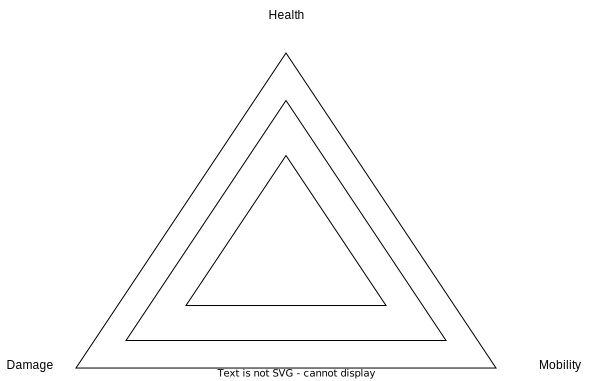

# Gameplay Overview

Overview of basic gameplay features and sequences

## Standard Gameplay Sequence

## Concept

A gameplay akin to chess, with Characters on a board, which is played out in turns. Each turn, players set commands to each unit one of their units on the Board. First, characters move, then they attack. All commands are set executed at the same time. Last one to still have characters on the board wins.

## Board

The board is a grid which consists in it's most basic form of a 9x9 grid. With 3x9 Tiles of starting space, in which the Player can position his characters freely. After which, the characters adhere to their movement pattern.

## Characters

Characters roam the board and adhere to their Movement and Attack patterns each turn, they also have an amout of damage they deal, aswell as their health. These should be balanced out, so no character is fast, while having a lot of health and damage. Typical classes could be:

- Tank
  - High Health
  - Low Movement
  - Low Damage

- Scout
  - High Movement
  - Low Damage
  - Low health

- Ranger
  - Mid Movement
  - Mid Damage
  - Low Health

## Commands

Each Turn and devided into these Categories:

### Movement

Movement Commands mean, that Characters will move this turn and cannot attack. When colliding with another Character, they bounce and noone moves. Characters can also not move to a tile, which is currently occupied by other Characters.

### Attack

Attack commands describe a character, which will attack in this turn, they can either be single tile damage, or area-of-affect damage and target mutliple targets.

