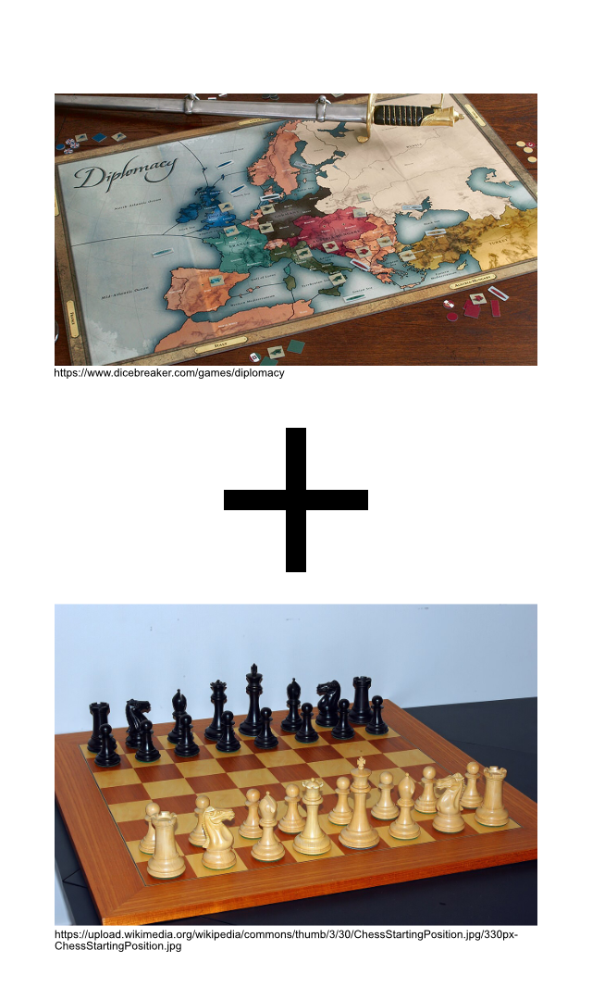
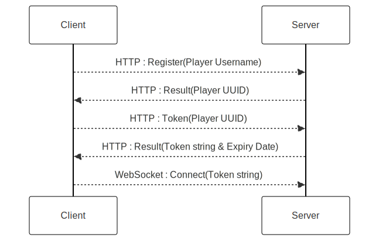

# Fantasy-Chess

A PvP multiplayer browser game.

> Marc Matija, Jacinto Schwarzwälder, Lukas Walker, Albano Vukelaj, Dania Anwar, Adnan Bennis

---

# Pitch

- Kombination aus der chaotischen Natur von Diplomacy mit der schnellen Strategie von Schach
- Größe Überraschungen und höhere schwierigkeit 



<!-- _footer: "B-Team: Marc Matija"-->

---

# Live Demo

<!--
    Live Demo ähnlich zum Games Day, einer hat einen Laptop offen
    und ist auf dem Server vorbereitet. Um den lobby Browser zu zeigen
    wir öffnen eine Lobby und spielen ein wenig.
-->

<!-- _footer: "B-Team: Marc Matija"-->

---

# Agenda (WIP)
- Projektorganisation
- Generelles Spiel
- Technische Umsetzung
- Qualität
- Doku
- (Zukunft)
<!-- 1. Begrüßung `Marc`
2. Pitch <code>Marc</code>
3. Projektorganisation <code>Jacinto</code>
3.1 Scrum + Sprintstruktur <code>Jacinto</code>
3.2 Technologien <code>Adnan</code> 
4. "Spiel an sich"
4.a Screens <code>Dania</code> 
4.b Hauptmenu <code>Albano</code> 
4.c GameScreen + Spielzyklus <code>Lukas</code> 
4.d CharacterEntities + Animationen <code>Lukas</code> 
4.dd Patterns <code>Lukas</code>
4.e Interaktion mit dem Spiel (Mausumrechnung) <code>Jacinto</code> 
4.f Turn Logic + Validation <code>Albano</code> + <code>Jacinto</code> 
4.w Character Integration <code>daniiaaa</code> 
4.x Design (bzw. Map Design) <code>daniiaaa</code>
4.y Server <code>Marc</code> 
4.4 Kommunikation Client <-> Server <code>Marc</code> 
5. Qualität <code>Albano</code>
5.1 Wie wurde getestet <code>Albano</code> 
5.2 Was haben wir getestet <code>Albano</code> 
6. Doku <code>Adnan</code>
6.1 Doku zeigen <code>Adnan</code> 
6.2 Spielanleitung <code>Adnan</code> 
Z. Zukunft <code>Wer noch was braucht</code>
-->

---

# Introduction

---

# Projektorganisation

---

# Scrum

---

# Technologie

---

# Spiel an sich

---

# Turn Logic

Rundenbasierte Regeln:

- Jeder Charakter darf nur einen Befehl (Angriff oder Movement) haben
- Befehle dürfen nicht außerhalb der Map liegen
- Befehle müssen sich an die Movement / Attack Patterns der Charaktere halten -> Charaktere vom Server als anticheat
- Charaktere dürfen sich nicht dahin bewegen, wo andere Charaktere sind<br />-> Auch nicht wenn der sich wegbewegt
- Mehrere Spieler dürfen sich nicht an die gleiche Stelle bewegen
- Eigener Check für Charktere gegnerischer Spieler -> "Bounces"

<!--Ggf. Gif von Bounces oder so-->
<!--Ggf. Architekturmodell oder so-->

---

# Server

- Springboot Projekt agierend als WebSocket Server
- Eigene WebSocket Protokoll lösung wegen limitationen auf der client seite.
- H2 zum Speichern der Daten während der Entwicklung 
- umstellungsmöglichkeit auf PostgreSQL für Produktions Deployment


<!-- _footer: "B-Team: Marc Matija"-->

---


# Aufbau

**Controller:**  
- verarbeiten HTTP Request

**Service:**
- Verbindung zwischen WebSocket Nachrichten und der Datenbank
- Eigentliche Logik des Servers

<!-- _footer: "B-Team: Marc Matija"-->

---

# Auth



> Für nähere infos: [`Authentication`](https://b-team-organisation.github.io/Fantasy-Chess/authentication.html)

<!-- _footer: "B-Team: Marc Matija"-->

---

# Packet Handling

**[WebSocketService](https://b-team-organisation.github.io/Fantasy-Chess/services.html#websocket-service)**: 
Routed Pakete zu passenden `PacketHandler` instanzen

**[PacketHandler](https://b-team-organisation.github.io/Fantasy-Chess/java-docs/server/com/bteam/fantasychess_server/client/PacketHandler.html):**
```java
public interface PacketHandler {
    void handle(Client client,String id, String packet);
    String getPacketPattern();
}
```

**[Game Packet Handler](https://b-team-organisation.github.io/Fantasy-Chess/packet-handler.html#game-packet-handler):** Packet Pattern: `GAME_`

**[Lobby Packet Handler](https://b-team-organisation.github.io/Fantasy-Chess/packet-handler.html#lobby-packet-handler):** Packet Pattern: `LOBBY_`

**[Player Packet Handler](https://b-team-organisation.github.io/Fantasy-Chess/packet-handler.html#player-packet-handler):** Packet Pattern: `PLAYER_`

<!-- _footer: "B-Team: Marc Matija"-->

---

# Qualität

---

# Doku

---

# Zukunft

