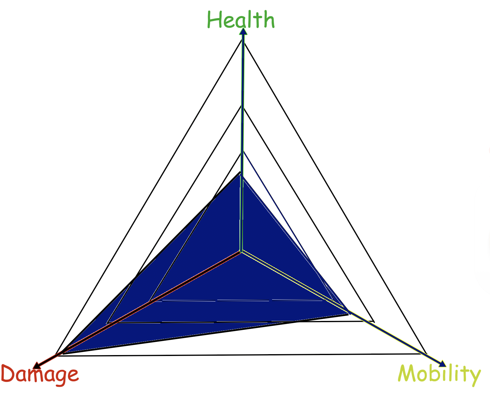

# Fantasy-Chess

A PvP multiplayer browser game.

> Marc Matija, Jacinto Schwarzwälder, Lukas Walker, Albano Vukelaj, Dania Anwar, Adnan Bennis

---

# Begrüßung

---

# Agenda (WIP)
- Projektorganisation
- Generelles Spiel
- Technische Umsetzung
- Qualität
- Doku
- (Zukunft)
<!-- 1. Begrüßung `Marc`
2. Pitch <code>Marc</code>
3. Projektorganisation <code>Jacinto</code>
3.1 Scrum + Sprintstruktur <code>Jacinto</code>
3.2 Technologien <code>Adnan</code> 
4. "Spiel an sich"
4.a Screens <code>Dania</code> 
4.b Hauptmenu <code>Albano</code> 
4.c GameScreen + Spielzyklus <code>Lukas</code> 
4.d CharacterEntities + Animationen <code>Lukas</code> 
4.dd Patterns <code>Lukas</code>
4.e Interaktion mit dem Spiel (Mausumrechnung) <code>Jacinto</code> 
4.f Turn Logic + Validation <code>Albano</code> + <code>Jacinto</code> 
4.w Character Integration <code>daniiaaa</code> 
4.x Design (bzw. Map Design) <code>daniiaaa</code>
4.y Server <code>Marc</code> 
4.4 Kommunikation Client <-> Server <code>Marc</code> 
5. Qualität <code>Albano</code>
5.1 Wie wurde getestet <code>Albano</code> 
5.2 Was haben wir getestet <code>Albano</code> 
6. Doku <code>Adnan</code>
6.1 Doku zeigen <code>Adnan</code> 
6.2 Spielanleitung <code>Adnan</code> 
Z. Zukunft <code>Wer noch was braucht</code>
-->

---

# Introduction

---

# Projektorganisation

---

# Scrum

---

# Technologie

---

# Spiel an sich

---

<!-- _footer: "B-Team: Albano Vukelaj"-->

# Charakter-Balancing

 Balancieren von **Leben, Angriff und Bewegung**.

### Prozess-Übersicht:
1. Richtlininien erstellt
2. Richtlinien befolgt
3. 15 Charaktere vorgeschlagen,**2 pro Typ**.  
4. 6 endgültige Charaktere ausgewählt.   
5. Mathematische Balance durch ein Balancing-Dreieck  
6. Charaktere getestet und feinjustiert.

---

#  Von der Theorie zur Praxis

Visualisierung des **Health-Attack-Movement-Dreiecks**.

- **Alle Charaktere** im Dreieck eingezeichnet.  
- Werte so angepasst, dass jeder ein **ähnliches Gesamtvolumen** hat.  

> **Theorie ≠ Praxis!** Anpassungen waren notwendig, um das Balancing im echten Spiel zu verbessern.

---

<!-- _footer: "B-Team: Albano Vukelaj"-->

# Balanzierung Prometheus

<!--i will change this img-syntax on tuesday-->

<!-- if possible description of his stats, tuesday -->

---

# Turn Logic

Rundenbasierte Regeln:

- Jeder Charakter darf nur einen Befehl (Angriff oder Movement) haben
- Befehle dürfen nicht außerhalb der Map liegen
- Befehle müssen sich an die Movement / Attack Patterns der Charaktere halten -> Charaktere vom Server als anticheat
- Charaktere dürfen sich nicht dahin bewegen, wo andere Charaktere sind -> Auch nicht wenn der sich wegbewegt
- Mehrere Spieler dürfen sich nicht an die gleiche Stelle bewegen
- Eigener Check für Charktere gegnerischer Spieler -> "Bounces"

<!--Ggf. Gif von Bounces oder so-->
<!--Ggf. Architekturmodell oder so-->

---

# Qualität

---

# Doku

---

# Zukunft

