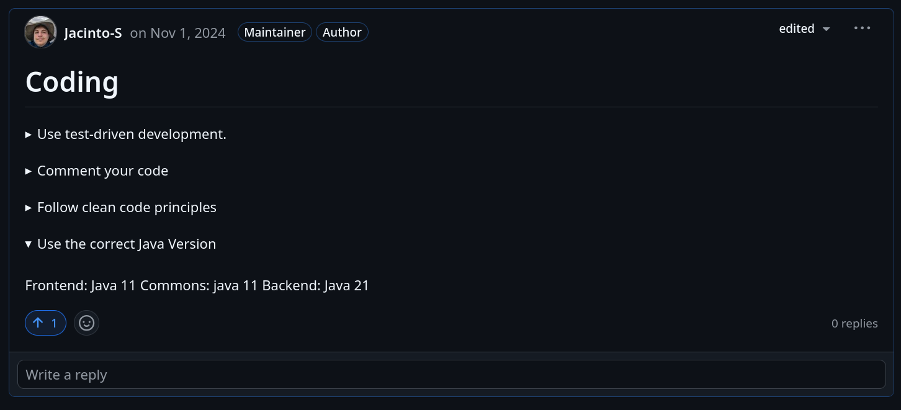
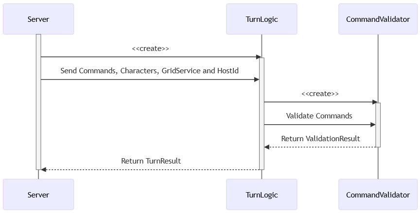

# Fantasy-Chess

A PvP multiplayer browser game.

> Marc Matija, Jacinto Schwarzwälder, Lukas Walker, Albano Vukelaj, Dania Anwar, Adnan Bennis

---

# Pitch

- 1v1-Taktikkämpfe auf einem 9×9-Board
- Bluffen & Vorausdenken
- Weniger Wartezeiten, mehr Action
- Vielfältige Charakterfähigkeiten

- Einfache Netzwerk Struktur durch runden-basiertes Kampfsystem

<!-- _something funny here idk_ -->


<!-- _footer: "B-Team: Marc Matija"-->

---

# Live Demo

<!--
    Live Demo ähnlich zum Games Day, einer hat einen Laptop offen
    und ist auf dem Server vorbereitet. Um den lobby Browser zu zeigen
    wir öffnen eine Lobby und spielen ein wenig.
-->

<!-- _footer: "B-Team: Marc Matija"-->

---

# Agenda (WIP)
- Projektorganisation
- Generelles Spiel
- Technische Umsetzung
- Qualität
- Doku
- (Zukunft)


<!-- 1. Begrüßung `Marc`
2. Pitch <code>Marc</code>
3. Projektorganisation <code>Jacinto</code>
3.1 Scrum + Sprintstruktur <code>Jacinto</code>
3.2 Technologien <code>Adnan</code> 
4. "Spiel an sich"
4.a Screens <code>Dania</code> Welche haben wir, wozu dienen sie (grob)
4.b Hauptmenu <code>Albano</code> 
4.c CharacterDataModel + Entity <code>Albano</code>
4.d Balancing <code>Albano</code>
4.e GameScreen + Spielzyklus <code>Lukas</code> 
4.f CharacterSprite + Animationen <code>Lukas</code> 
4.g Patterns <code>Lukas</code>
4.h Interaktion mit dem Spiel (Mausumrechnung) <code>Jacinto</code> 
4.i Turn Logic + Validation <code>Jacinto</code> 
4.j Character Integration <code>daniiaaa</code> 
4.k Design (bzw. Map Design) <code>daniiaaa</code>
4.l Figma + Tileset + MapDesign <code>daniiaaa</code>
4.m Server <code>Marc</code> 
4.n Kommunikation Client <-> Server <code>Marc</code> 
5. Qualität <code>Albano</code>
5.1 Wie wurde getestet <code>Albano</code> 
5.2 Was haben wir getestet <code>Albano</code> 
6. Doku <code>Adnan</code>
6.1 Java Doc <code>Adnan</code> 
6.2 Doku zeigen (Writerside) <code>Adnan</code> 
6.3 Spielanleitung <code>Adnan</code> 
Z. Zukunft <code>Wer noch was braucht</code>
-->

---

# Introduction

---

# Projektorganisation

---

# Scrum

- Scrum Master: Marc
- Sprints gingen 2 Wochen
- Meetings wöchentlich 1x online (DC), 1x in Person

---

# Clockify


---

# Github

- Das Fantasy-Chess Repository wurde auf Github gehostet
- Mit Github Pages wurde die Doku gehostet
- Mit Github Projects haben wir unser Task Management gemacht

---

# Kanban


---

# Guidelines


---

# Prototyping


---

# Scrum

---

# Spiel

---

<!-- _footer: "B-Team: Albano Vukelaj "-->

## 4.1 Hauptmenü

<style scoped>
  img.center {
    float: center;
    margin-left : 230px;
    
  }
</style>


--- 

<!-- _footer: "B-Team: Albano Vukelaj"-->

<style scoped>
  img.right {
    float: right;
    margin-left: 20px; 
    margin-top: 0px;
    max-width: 60%; 
  }
</style>


### Funktionen
- Lobby-Suche
- Datenaktualisierung
- Lobby-Erstellung

### Vorteile des Hauptmenüs
- Benutzerfreundlichkeit
- Flexibilität
- Effizienz

---

# Technologien

---

# Serverseite

- **Spring Boot 6 & Java 21**
  - Modernes Framework für Backend-Entwicklung
- **Spring Messaging**
  - WebSocket-Verbindungen für Echtzeitkommunikation
- **Spring JPA & Hibernate**
  - ORM für einfache Datenverarbeitung
- **H2 Datenbank**
  - Leichtgewichtige Entwicklungsdatenbank
- **PostgreSQL**
  - Stabile Datenbank für Produktion
  
<!-- _footer: "B-Team: Adnan Bennis"-->

---

# Hosting

- **Git**
  - Versionskontrolle für Zusammenarbeit
- **Plesk**
  - Verwaltung von Hosting und Servern
- **Docker**
  - Containerisierte Bereitstellung
- **nginx**
  - Hochleistungs-Webserver

<!-- _footer: "B-Team: Adnan Bennis"-->

---

# Clientseite

- **LibGDX**
  - Cross-Plattform-Spieleentwicklungsframework
- **GWT Deployment**
  - Browser-basiertes Spielen ohne Downloads
  - Java-Code kompiliert in JavaScript (Java 11 Einschränkungen)

<!-- _footer: "B-Team: Adnan Bennis"-->

---

# Client Tools

- **TexturePacker**
  - Erstellung von Texture Atlanten
- **SkinComposer**
  - Anpassbare UI-Skin-Erstellung
- **Tiled**
  - Map-Editor mit einfacher Code-Integration
- **Piskel**
  - Pixel-Art-Editor für Grafiken

<!-- _footer: "B-Team: Adnan Bennis"-->

---

# Spiel an sich

---

# Game Interaction

---

# Coordinate Systems


---

# Grid to World


---

# World to Grid


---

# Game Screen

<!-- Bild vom Gamescreen: Command Mode -->


<!-- _footer: "B-Team: Lukas Walker"-->

---

# Game Screen - Zyklus

<!-- Zyklus Diagram -->


<!-- _footer: "B-Team: Lukas Walker"-->

---

# Game Screen - Initialisation

<!-- Bild vom Gamescreen: Init Mode -->


<!-- _footer: "B-Team: Lukas Walker"-->

---

# Game Screen - Command Mode

<!-- Bild vom Gamescreen: Command Mode -->


<!-- _footer: "B-Team: Lukas Walker"-->

---

# Game Screen - Command Menu

<!-- Bild vom Gamescreen: Command Menu -->


<!-- _footer: "B-Team: Lukas Walker"-->

---

# Game Screen - Move Command Mode

<!-- Bild vom Gamescreen: Command Mode -->


<!-- _footer: "B-Team: Lukas Walker"-->

---

# Game Screen - Attack Command Mode

<!-- Bild vom Gamescreen: Command Mode -->


<!-- _footer: "B-Team: Lukas Walker"-->

---

# Game Screen - Turn Outcome Animation

<!-- Video vom Gamescreen: Turn Outcome Animation -->

<div align="center">
  <video width="900" autoplay loop muted playsinline>
    <source src="assets/vid/TurnOutcomeAnimation.mp4" type="video/mp4">
    Your browser does not support the video tag.
  </video>
</div>

<!-- _footer: "B-Team: Lukas Walker"-->

---

# CharacterSprite

## Graphische Representation eines CharacterEntities
- Methoden zum Rendern
- Methoden zum Bewegen
- Methoden zum Überprüfen/Vorantreiben der Animation


<!-- _footer: "B-Team: Lukas Walker"-->

---

# Turn Result Animation Handler

## Orchestriert Animation eines TurnResults
- Queue mit Animationsobjekten füllen
- Animationen abarbeiten
- Abschluss kommunizieren

<!-- _footer: "B-Team: Lukas Walker"-->

---

# Turn Result Animation Handler

<!-- UML: Animations -->


<!-- _footer: "B-Team: Lukas Walker"-->

---

# Patterns

## Datenstruktur zum Speichern von Befehlsmustern
- Einfach zu erstellen und lesen
- Gut skalierbar
- Alle vorstellbaren Muster speichern
- Wiederverwendbar

Umsetzung: Name + String-Representation + Subpattern-Mappings

<!-- _footer: "B-Team: Lukas Walker"-->

---

# Patterns - Beispiel

Name: plus
<pre>
String: " x 
         xxx
          x "
</pre>
Subpattern Mappings: -


<!-- _footer: "B-Team: Lukas Walker"-->

---

# Patterns - Beispiel

Name: bombThrow
<pre>
String: " +++ \n
         ++ ++\n
         +   +\n
         ++ ++\n
          +++ "
</pre>
Subpattern Mappings: '+' -> "plus"


<!-- _footer: "B-Team: Lukas Walker"-->

---

# Turn Logic

---

# Rundenbasierte Regeln

- Jeder Charakter darf nur einen Befehl (Angriff oder Movement) haben
- Befehle dürfen nicht außerhalb der Map liegen
- Befehle müssen sich an die Movement / Attack Patterns der Charaktere halten -> Charaktere vom Server als anticheat
- Charaktere dürfen sich nicht dahin bewegen, wo andere Charaktere sind<br />-> Auch nicht wenn der sich wegbewegt
- Mehrere Spieler dürfen sich nicht an die gleiche Stelle bewegen
- Eigener Check für Charktere gegnerischer Spieler -> "Bounces"

<!--Ggf. Gif von Bounces oder so-->
<!--Ggf. Architekturmodell oder so-->

---

# Sequenzdiagram



---

# Klassendiagramm


---

# Server

- Springboot Projekt agierend als WebSocket Server
- Eigene WebSocket Protokoll lösung wegen limitationen auf der client seite.
- H2 zum Speichern der Daten während der Entwicklung 
- Umstellungsmöglichkeit auf PostgreSQL für Produktions Deployment


<!-- _footer: "B-Team: Marc Matija"-->

---


# Aufbau

**Controller:**  
- Verarbeiten HTTP Request

**Service:**
- Verbindung zwischen WebSocket Nachrichten und der Datenbank
- Eigentliche Logik des Servers

<!-- _footer: "B-Team: Marc Matija"-->

---

# Architecture


<!-- _footer: "B-Team: Marc Matija"-->

---

# Auth


- Client regestriert sich auf dem Server
- Erhält UUID
- Fordert Token mit UUID an
- Bekommt Token und Auslaufdatum
- Verbindet sich mit Token

> Für nähere infos: [`Authentication`](https://b-team-organisation.github.io/Fantasy-Chess/authentication.html)

<!-- _footer: "B-Team: Marc Matija"-->

---

# [Token Service](https://b-team-organisation.github.io/Fantasy-Chess/services.html#token-service)

- Generiert Single-Use Token
- Speichert diesen im `TokenRepository`
- Validiert Token
- Invalidiert Token

**Token Format**: `V3D5qNVl8IpP2y_qEgQ24`
- 14 Character Base64URL String mit CRC8 Checksum

<!-- _footer: "B-Team: Marc Matija"-->

---

## [Packets](https://b-team-organisation.github.io/Fantasy-Chess/packet.html)

Simple Json struktur, welche die gesendeten Daten in `data` und die id des packets in `id` angibt

```json
{
  // strukturiert nach TOPIC_PACKET
  "id": "<PACKETID>", 
  "data" : {}
}
```

> Serialisiert mit [JsonWriter](https://b-team-organisation.github.io/Fantasy-Chess/json-writer.html)

<!-- _footer: "B-Team: Marc Matija"-->

---

# Packet Handling

**[WebSocketService](https://b-team-organisation.github.io/Fantasy-Chess/services.html#websocket-service)**: 
Routed Pakete zu passenden `PacketHandler` instanzen

**[PacketHandler](https://b-team-organisation.github.io/Fantasy-Chess/java-docs/server/com/bteam/fantasychess_server/client/PacketHandler.html):**
```java
public interface PacketHandler {
    void handle(Client client,String id, String packet);
    String getPacketPattern();
}
```

**[Game Packet Handler](https://b-team-organisation.github.io/Fantasy-Chess/packet-handler.html#game-packet-handler):** Packet Pattern: `GAME_`

**[Lobby Packet Handler](https://b-team-organisation.github.io/Fantasy-Chess/packet-handler.html#lobby-packet-handler):** Packet Pattern: `LOBBY_`

**[Player Packet Handler](https://b-team-organisation.github.io/Fantasy-Chess/packet-handler.html#player-packet-handler):** Packet Pattern: `PLAYER_`

<!-- _footer: "B-Team: Marc Matija"-->

---


<!-- _footer: "B-Team: Marc Matija"-->

---

# Services

- GameStateService
  - benutzt Turn Logic Service
- LobbyService
- PlayerService
- TokenService
- WebSocketService


<!-- _footer: "B-Team: Marc Matija"-->

---

# Client-Side

## Packet Handler
- 1 Packet Handler pro Packet
- Java Functional interface
```java
@FunctionalInterface
public interface PacketHandler {
  void handle(String packet);
}
```


<!-- _footer: "B-Team: Marc Matija"-->

---

# Qualität
<!-- _footer: "B-Team: Albano Vukelaj"-->

 **Ziele:**
  - Fehlerfreiheit und robuste Funktionen
  - Intuitive und reibungslose Spielerfahrung
  - Erweiterbarkeit des Codes für zukünftige Features

---

<!-- _footer: "B-Team: Albano Vukelaj"-->

# Qualität - Common Module

## Wie wurde getestet?

- **Automatisierte Tests:** Getestet mit **JUnit** 
- **Ansatz:**
  - **Unit Tests:** Methoden lieferten korrekte Ergebnisse.
  - **Edge Cases:** Null-Werte und Extreme getestet.

---

<!-- _footer: "B-Team: Albano Vukelaj"-->

# Qualität - Common Module

## Was wurde getestet?

- **Models:**  
  Datenintegrität 
- **DTOs:**  
  Korrekte Serialisierung/Deserialisierung 
- **Services:**  
  Spiel-Logik

---

<!-- _footer: "B-Team: Albano Vukelaj"-->

# Qualität - Client Module

## Wie wurd getestet?

- **Manual Testing:**  
  Erforderlich wegen komplexer Spielzustände und visueller Validierung, GWT
- **Ansatz:**
  - **Szenarien:** Testen des Spielflusses durch Playtests
  - **Input Reaktionen:** Validieren der korrekten Reaktion auf Inputs
  - **Funktionstests:** UI-Reaktionen und Gameplay-Funktionen wurden geprüft
---

<!-- _footer: "B-Team: Albano Vukelaj"-->

# Qualität - Client Module

## Was wurde getestet?

- **Funktionalität:**
  - Spielschleife funktioniert fehlerfrei
  - Serverkommunikation und Verarbeitung der Antworten
  - Erwartete Reaktionen auf verschiedenen Eingaben
- **Rendering und Animationen:**
  - Korrektes Rendering aller Elemente
  - Korrekte CommandPreview and TurnOutcome
- **UI Testing:**  
  - Stat-Overlays und Dialoge

---

<!-- _footer: "B-Team: Albano Vukelaj"-->

# Qualität - Server Module

## Wie wurde getestet?

- **Automatisierte Tests:** Backend-Logik und WebSocket-Kommunikation mit **Unit Tests** 
- **Ansatz:**
  - WebSocket-Verbindungen und Nachrichten validiert
  - REST-Endpunkte getestet
  - Packet handling, services

---

<!-- _footer: "B-Team: Albano Vukelaj"-->

# Qualität - Server Module

## Was wurde getestet?

- **WebSocket Services:**  
  Stabilität von Verbindungen und Nachrichtennutzlasten 
- **Controllers:**  
  REST-Endpunkte validiert
- **Handlers:**  
  Ereignis- und Paketverarbeitung überprüft
  
---

# Dokumentation

---

# Tools für die Dokumentation

- **Writerside** → Strukturiertes Schreiben, direkt im Browser aufrufbar
- **Javadoc** → Code-Dokumentation für Entwickler


<!-- _footer: "B-Team: Adnan Bennis"-->
---

# Dokumentation mit Writerside
- Writerside ermöglicht eine zentrale, gut strukturierte Dokumentation
- **Vorteile:**
  - Unterstützung für **Markdown**
  - Inhalte sind direkt im **Browser** aufrufbar
  - **Einfache Navigation** durch verschiedene Dokumentationsbereiche
  - Perfekt für Benutzeranleitungen, Entwickler-Dokus und Architektur-Übersichten

<!-- _footer: "B-Team: Adnan Bennis"-->
---


# Dokumentation mit Javadoc

- Verbessert die Lesbarkeit und Wartbarkeit des Codes
- Gibt Entwicklern klare Anweisungen zur Nutzung von Klassen und Methoden
- Automatisch generierte HTML-Dokumentation:
  - Kann einfach geteilt und im Browser angezeigt werden
- Verhindert Missverständnisse durch klare Beschreibungen

<!-- _footer: "B-Team: Adnan Bennis"-->
---

# Beispiele: 

## GridService Klasse

```java
/**
 * Service class for the {@link GridModel}
 * <p>
 * This class wraps a gridModel instance and provides useful functions for grid-manipulation and data-retrieval.
 *
 * @author Lukas, Albano
 * @version 1.0
 */
public class GridService {
    ...
}
```

<!-- _footer: "B-Team: Adnan Bennis"-->
---

## Methode mit Javadoc

```java
/**
     * Subtracts two vectors to get a new one with subtracted coordinates.
     *
     * @param vector - the vector to subtract
     * @return a new vector with the subtracted coordinates
     */
    public Vector2D subtract(Vector2D vector) {
        return new Vector2D(this.x - vector.getX(), this.y - vector.getY());
    }
```

<!-- _footer: "B-Team: Adnan Bennis"-->
---

## Methode mit Parameter
```java
/**
 * Makes the {@link TextField} only accept letters, digits 
 * and other defined chars as input.
 *
 * @param textField the {@link TextField} to apply the filter to.
 */
private void addNameFilter(TextField textField) {
    ...
}
```

<!-- _footer: "B-Team: Adnan Bennis"-->

---

# Zukunft

