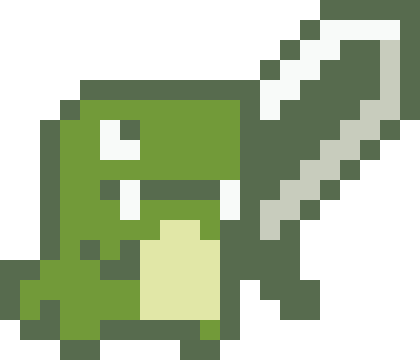
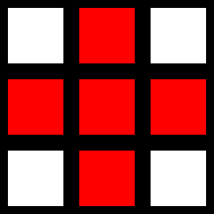

# Fantasy-Chess

A PvP multiplayer browser game.

> Marc Matija, Jacinto Schwarzwälder, Lukas Walker, Albano Vukelaj, Dania Anwar, Adnan Bennis

---

# Begrüßung

---

# Agenda (WIP)
- Projektorganisation
- Generelles Spiel
- Technische Umsetzung
- Qualität
- Doku
- (Zukunft)

<!-- 1. Begrüßung `Marc`
2. Pitch <code>Marc</code>
3. Projektorganisation <code>Jacinto</code>
3.1 Scrum + Sprintstruktur <code>Jacinto</code>
3.2 Technologien <code>Adnan</code> 
4. "Spiel an sich"
4.a Screens <code>Dania</code> Welche haben wir, wozu dienen sie (grob)
4.b Hauptmenu <code>Albano</code> 
4.c CharacterDataModel + Entity <code>Albano</code>
4.d Balancing <code>Albano</code>
4.e GameScreen + Spielzyklus <code>Lukas</code> 
4.f CharacterSprite + Animationen <code>Lukas</code> 
4.g Patterns <code>Lukas</code>
4.h Interaktion mit dem Spiel (Mausumrechnung) <code>Jacinto</code> 
4.i Turn Logic + Validation <code>Jacinto</code> 
4.j Character Integration <code>daniiaaa</code> 
4.k Design (bzw. Map Design) <code>daniiaaa</code>
4.l Figma + Tileset + MapDesign <code>daniiaaa</code>
4.m Server <code>Marc</code> 
4.n Kommunikation Client <-> Server <code>Marc</code> 
5. Qualität <code>Albano</code>
5.1 Wie wurde getestet <code>Albano</code> 
5.2 Was haben wir getestet <code>Albano</code> 
6. Doku <code>Adnan</code>
6.1 Java Doc <code>Adnan</code> 
6.2 Doku zeigen (Writerside) <code>Adnan</code> 
6.3 Spielanleitung <code>Adnan</code> 
Z. Zukunft <code>Wer noch was braucht</code>
-->

---

# Introduction

---

# Projektorganisation

---

# Scrum

---

# Technologie

---

# Spiel an sich

---

# Game Screen

<!-- Bild vom Gamescreen: Command Mode -->

<!-- _footer: "B-Team: Lukas Walker"-->

---

# Game Screen - Zyklus

<!-- Zyklus Diagram -->

<!-- _footer: "B-Team: Lukas Walker"-->

---

# Game Screen - Initialisation

<!-- Bild vom Gamescreen: Init Mode -->

<!-- _footer: "B-Team: Lukas Walker"-->

---

# Game Screen - Command Mode

<!-- Bild vom Gamescreen: Command Mode -->

<!-- _footer: "B-Team: Lukas Walker"-->

---

# Game Screen - Command Menu

<!-- Bild vom Gamescreen: Command Menu -->

<!-- _footer: "B-Team: Lukas Walker"-->

---

# Game Screen - Move Command Mode

<!-- Bild vom Gamescreen: Command Mode -->

<!-- _footer: "B-Team: Lukas Walker"-->

---

# Game Screen - Attack Command Mode

<!-- Bild vom Gamescreen: Command Mode -->

<!-- _footer: "B-Team: Lukas Walker"-->

---

# Game Screen - Turn Outcome Animation

<!-- Video vom Gamescreen: Turn Outcome Animation -->

  <video width="900" autoplay loop muted playsinline>
    <source src="assets/vid/TurnOutcomeAnimation.mp4" type="video/mp4">
    Your browser does not support the video tag.
  </video>

<!-- _footer: "B-Team: Lukas Walker"-->

---

# CharacterSprite

## Graphische Representation eines CharacterEntities
- Methoden zum Rendern
- Methoden zum Bewegen
- Methoden zum Überprüfen/Vorantreiben der Animation

<!-- _footer: "B-Team: Lukas Walker"-->

---

# Turn Result Animation Handler

## Orchestriert Animation eines TurnResults
- Queue mit Animationsobjekten füllen
- Animationen abarbeiten
- Abschluss kommunizieren

<!-- _footer: "B-Team: Lukas Walker"-->

---

# Turn Result Animation Handler

<!-- UML: Animations -->

<!-- _footer: "B-Team: Lukas Walker"-->

---

# Patterns

## Datenstruktur zum Speichern von Befehlsmustern
- Einfach zu erstellen und lesen
- Gut skalierbar
- Alle vorstellbaren Muster speichern
- Wiederverwendbar

Umsetzung: Name + String-Representation + Subpattern-Mappings

<!-- _footer: "B-Team: Lukas Walker"-->

---

# Patterns - Beispiel

Name: plus
<pre>
String: " x 
         xxx
          x "
</pre>
Subpattern Mappings: -

<!-- _footer: "B-Team: Lukas Walker"-->

---

# Patterns - Beispiel

Name: bombThrow
<pre>
String: " +++ \n
         ++ ++\n
         +   +\n
         ++ ++\n
          +++ "
</pre>
Subpattern Mappings: '+' -> "plus"

<!-- _footer: "B-Team: Lukas Walker"-->

---

# Turn Logic

Rundenbasierte Regeln:

- Jeder Charakter darf nur einen Befehl (Angriff oder Movement) haben
- Befehle dürfen nicht außerhalb der Map liegen
- Befehle müssen sich an die Movement / Attack Patterns der Charaktere halten -> Charaktere vom Server als anticheat
- Charaktere dürfen sich nicht dahin bewegen, wo andere Charaktere sind -> Auch nicht wenn der sich wegbewegt
- Mehrere Spieler dürfen sich nicht an die gleiche Stelle bewegen
- Eigener Check für Charktere gegnerischer Spieler -> "Bounces"

<!--Ggf. Gif von Bounces oder so-->
<!--Ggf. Architekturmodell oder so-->

---

# Qualität

---

# Doku

---

# Zukunft

